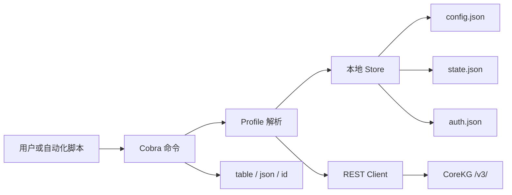
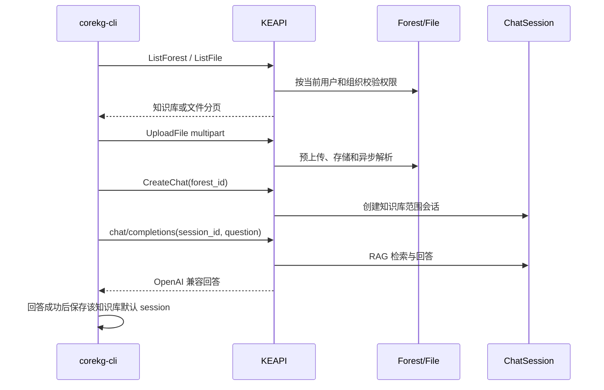
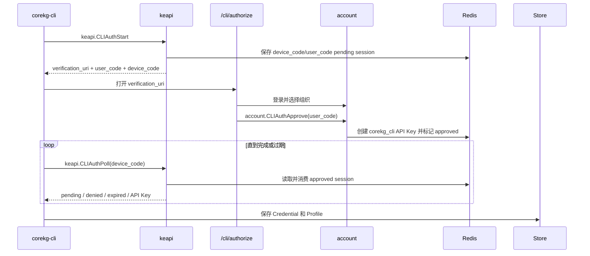

# CoreKG CLI 架构设计

## 1. 定位和边界

`corekg-cli` 位于 `clients/corekg-cli`，是可独立构建、安装和分发的 Go CLI。它调用 CoreKG 的 `/v3/<action>` REST API，与 MCP Server 共用服务端业务能力，但不复用 MCP 的传输会话。

当前实现覆盖版本、配置、Profile、认证、知识库创建/列表/选择、知识库文件列表/上传和知识库范围问答。MCP Tool 透传不属于当前能力。

`kb create` 调用 `keapi.CreateForest`。命令层负责交互采集名称、描述和头像地址，并固定提交 `forest_type=file`，在最终确认后才发起远端创建；`--yes` 用于提供完整参数的自动化执行。创建成功后默认只输出结果，不改变本地 Profile；`--use` 才在远端成功后通过 Store 锁更新当前知识库选择。

## 2. 目录架构

```text
clients/corekg-cli/
├── main.go                         # 二进制入口
├── internal/
│   ├── api/                        # CoreKG envelope 和领域请求/响应
│   ├── auth/                       # Device Authorization 轮询、打开浏览器
│   ├── buildinfo/                  # ldflags 注入的版本信息
│   ├── clierr/                     # 错误类型、错误码和退出码
│   ├── commands/                   # Cobra 命令和业务编排
│   ├── output/                     # table/json/id 输出
│   ├── store/                      # config/state/auth、兼容迁移、锁和原子写入
│   └── transport/                  # URL、安全请求和 HTTP 限制
├── npm/corekg-cli/                 # 单一 npm 包和内置多平台二进制
├── scripts/package-npm.sh          # 多平台构建和版本同步
└── docs/                           # 架构和使用说明
```

命令层不直接拼接 HTTP 路径或操作 JSON 文件；API/Transport 负责远程协议，Store 负责本地持久化。

## 3. 运行时数据流



普通业务命令的流程：

1. Cobra 解析全局参数和命令参数。
2. Runtime 按 `--profile`、`COREKG_PROFILE`、`current_profile` 的优先级选择 Profile。
3. Store 从 `auth.json` 读取 Profile 引用的 Credential 和 API Key。
4. API Client 调用 `/v3/<action>`，在需要时带上 `Authorization: Bearer <API_KEY>`。
5. 命令层按 `table`、`json` 或 `id` 输出结果。

文件和问答的数据流为：



Transport 默认超时 30 秒，只接受 `http`/`https`，拒绝带用户名密码、Query、Fragment 的 Server URL，拒绝重定向，并限制普通 JSON 响应大小。上传和问答分别使用不低于十分钟、两分钟的命令专用超时；显式传入命令专用参数时优先于全局超时。

## 4. Profile 和多组织

Profile 是 CLI 的本地执行边界，绑定：

- 一个 CoreKG Server URL；
- 一个 Credential ID；
- 一个用户组织身份；
- 可选的默认知识库。

一个 Profile 对应一个组织身份。一个账号有多个组织时，在浏览器登录流程中每次选择一个组织，并为每个组织保存一个 Profile。这样命令执行时身份是确定的，不需要在 CLI 中保存或切换 JWT，也不会把“当前组织”混入服务端全局状态。

`--profile NAME` 是单次命令覆盖，不修改 `current_profile`。未传该参数时还可使用 `COREKG_PROFILE`；最后才使用配置中的当前 Profile。`profile use -` 可切回上一个 Profile。

静态配置固定写入 `~/.corekg/config.json`：

```json
{
  "version": 1,
  "server": "http://127.0.0.1:8080",
  "frontend": "http://localhost:3001",
  "output": "table",
  "timeout": "30s"
}
```

Profile、知识库选择和按知识库保存的最近会话状态独立写入 `~/.corekg/state.json`：

```json
{
  "version": 2,
  "current_profile": "work",
  "profiles": {
    "work": {
      "server": "https://corekg.example.com",
      "credential": "credential-id",
      "organization_id": "10001",
      "organization_name": "Example Org",
      "knowledge_base_id": "20001",
      "knowledge_base_name": "Product Docs",
      "chat_sessions": {
        "20001": 30001
      }
    }
  }
}
```

Store 仍可读取早期 `setting.json` 中的 `server`/`output` 或 `default_server`/`default_output`，以及 `current_context`/`contexts` 字段；后续保存分别迁移到 `config.json` 和 `state.json`，不删除旧文件。公开 CLI 命令不再注册 `context` 命令，也不再提供 `--context`。

## 5. 本地认证存储

`auth.json` 保存 Credential 和未完成登录状态：

```json
{
  "version": 2,
  "credentials": {
    "credential-id": {
      "server": "https://corekg.example.com",
      "api_key": "<REDACTED>",
      "source": "device_login",
      "api_key_id": 30001,
      "api_key_purpose": "corekg_cli",
      "uin": 10001,
      "organization_id": "10001",
      "organization_name": "Example Org"
    }
  },
  "pending_logins": {}
}
```

`auth list`、`auth status` 和普通输出都不会打印 API Key。当前 API Key 是受文件权限保护的明文 JSON，不是系统钥匙串；共享主机上应使用独立系统账户。自定义 `--config` 只覆盖当前运行，不改变配置文件来源；状态和认证始终写入默认目录。

Store 的写入约束：

- 配置目录 `0700`，JSON 文件 `0600`；
- 拒绝配置目录和文件符号链接；
- `.lock` 进行跨进程串行化；
- 同目录临时文件写入、同步后原子替换；
- 高于当前版本的配置拒绝加载，避免旧 CLI 覆盖新字段；
- 跨 `auth.json` 和 `state.json` 保存失败时尝试恢复认证文件。

## 6. 浏览器登录设计

浏览器登录采用服务端 Device Authorization，不在 CLI 收集密码，也不让 CLI 接触网页登录 JWT。



服务端动作：

- `keapi.CLIAuthStart`：无需 API Key，创建短时设备授权会话；
- `keapi.CLIAuthInfo`：网页根据 user code 显示客户端和会话状态；
- `keapi.CLIAuthPoll`：CLI 轮询，批准后一次性取回 API Key；
- `account.CLIAuthApprove`/`account.CLIAuthDeny`：已登录网页批准或拒绝；
- `keapi.RevokeCurrentAPIKey`：`auth logout --revoke` 撤销当前 API Key。

Redis 会话默认有效期 10 分钟，轮询间隔 5 秒。批准后轮询会消费会话中的密钥，设备码和用户码都不能用于再次获取密钥。

CLI 登录命令：

```sh
# 交互式登录，自动打开浏览器
corekg-cli auth login

# 不打开浏览器，仅打印 JSON，适合跳板机
corekg-cli auth login --no-wait -o json

# 在另一台设备完成网页授权后继续轮询
corekg-cli auth login --device-code <DEVICE_CODE>
```

登录成功后 CLI 自动创建或更新 Profile；默认名称来自组织名，重名时追加序号。`--name` 可显式指定 Profile 名称。对于多个组织，应分别执行登录并指定不同名称。

## 7. API Key 导入和退出

已有 API Key 可用以下三种方式之一导入：

```sh
corekg-cli auth import --name work
printf '%s\n' "$COREKG_API_KEY" | corekg-cli auth import --name work --api-key-stdin
corekg-cli auth import --name work --api-key-env COREKG_API_KEY
```

导入会先调用 `keapi.WhoAmI` 验证密钥，并记录组织元数据。CLI 没有明文 `--api-key` 参数，也不会隐式读取固定环境变量。

`auth logout --yes` 删除当前 Profile 对应的本地 Credential 和引用它的 Profile；加上 `--revoke` 会先调用 `keapi.RevokeCurrentAPIKey`，服务端撤销成功后才清理本地记录。

## 8. 输出和错误

- `table`：默认的人类可读表格；
- `json`：稳定的 `{ "ok": true, "data": ... }` 成功 envelope；
- `id`：每行一个名称或资源 ID。

JSON 错误输出到标准错误，包含错误类型、稳定错误码和必要的 API/HTTP 细节。退出码 0 表示成功，1 表示运行时或业务错误，2 表示输入错误，10 表示缺少 `--yes` 确认。

## 9. 构建分发

CLI 不新增嵌套 `go.mod`，使用根模块和 vendor 构建：

```sh
make corekg-cli
make corekg-cli-test
make corekg-cli-linux GOARCH=amd64
VERSION=0.1.0 make corekg-cli-npm-preflight
```

Go 构建默认 `CGO_ENABLED=0`。单一 `@insmtx/corekg-cli` npm 包内含 macOS arm64/x64、Linux arm64/x64 和 Windows x64 二进制，启动器按当前平台选择。npm 结构当前用于打包预检，不代表已发布到公共 registry。

## 10. 当前能力清单

| 能力 | 状态 |
|---|---|
| 版本、配置路径和默认设置 | 已支持 |
| Profile 列表、查看、切换、重命名、删除 | 已支持 |
| 浏览器 Device Authorization 登录 | 已支持 |
| API Key 导入、验证、列表和退出 | 已支持 |
| 服务端 API Key 撤销 | 已支持，使用 `auth logout --revoke` |
| 多 Server、多组织 Profile | 已支持 |
| 知识库列表和默认选择 | 已支持 |
| 知识库文件列表（分页/全部） | 已支持 |
| 文件上传（multipart/等待解析） | 已支持 |
| 知识库范围问答（会话复用/新会话） | 已支持 |
| MCP Tool 透传 | 不在当前范围 |
