# /chat.ChatQuestionStream 接口实现分析

## 概述

`/chat.ChatQuestionStream` 是核心聊天问答接口，提供流式 LLM 对话能力。根据会话的 `BaseType`（基础类型），系统分发到 **10 种**问答模式。

- **代码位置**: `apps/kechat/services/svcchat/chat.go:26`
- **API 入口**: `apps/kechat/internal/apis/chat_api.go:400`
- **路由注册**: `apps/kechat/internal/apis/apis.go:22`

---

## 整体流程

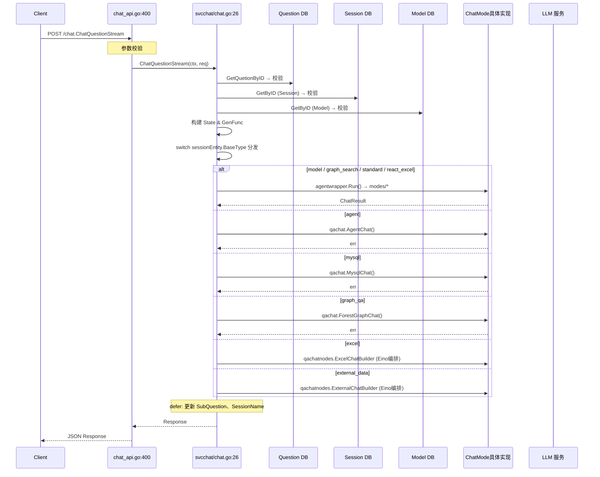

---

## BaseType 分发图

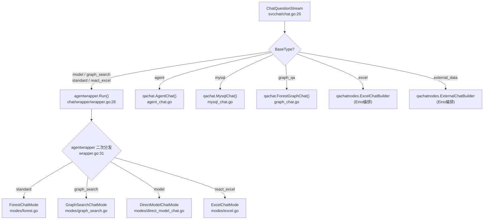

---

## 模式详解

### 新模式（agentwrapper/modes）

---

### 1. ForestChatMode — 标准知识库问答

**BaseType**: `standard`  
**文件**: `apps/kechat/chat/modes/forest.go:29`

知识库 RAG 问答：从 ES 中检索相关文档片段，结合 LLM ReAct Agent 模式进行多轮推理回答。

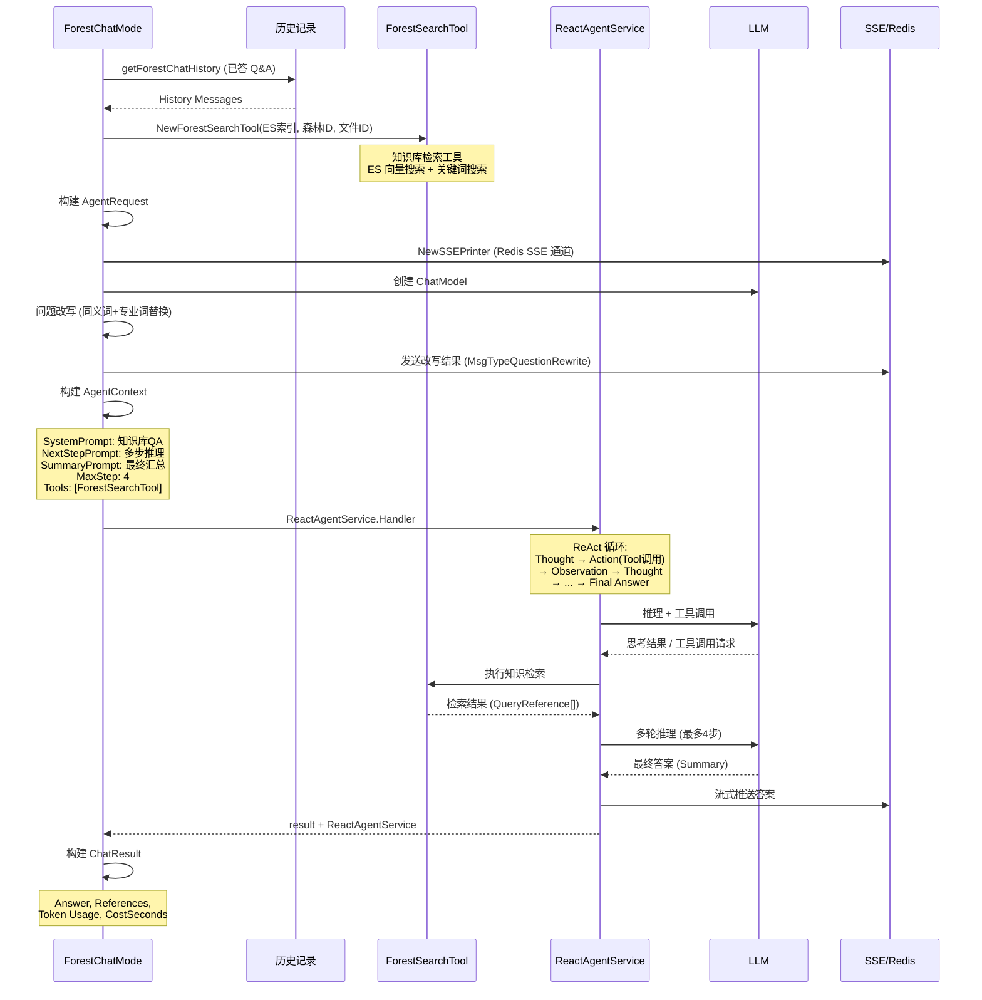

**关键特性**:
- ReAct Agent 模式，最多 4 步推理
- ES 向量 + 关键词混合检索
- 两次 LLM 分词改写：同义词替换 + 专业词补全
- ForestSearchTool 内部有 LLM QueryRewrite + 两次 Rerank 重排序

> 注：该模式替代了旧版 `qachat.ChatWapper.ForestChat()`。

#### 同义词和专业词替换流程

替换在 **每次问答请求时实时执行**，步骤为：

1. **LLM 分词**：`NewParticipleAgent`（`devkeywords/participle.go:43`）用 ADK Agent 调用 LLM，按 prompt 规则提取输入中的名词关键词（如 "后倒车雷达,维修步骤"）
2. **同义词替换**（`devkeywords/replace.go:17`）：用提取的名词查 `forest_keywords` 表中 `WordType=Synonym` 的记录，按 subject 分组取标准词替换 → "后倒车雷达" 替换为领域标准术语
3. **专业词补全**（`devkeywords/replace.go:138`）：用提取的名词查 `forest_keywords` 表中 `WordType=Major` 的记录 → "ABS" 补全为 "ABS(防抱死制动系统)"
4. 替换时**长词优先**（`replace.go:110`），避免短子串先被匹配导致长词无法替换

两个替换步骤都依赖 LLM 分词，因此**输入相同、分词结果可能不同**，导致替换后的 query 每次不完全一致。

#### 同一问题每次命中 chunk 不稳定的原因

以下为 `ForestChatMode` 从用户输入到最终 chunk 结果的**完整链路**，标注了每个产生不稳定输出的环节：

```
用户输入 "后倒车雷达维修步骤"
  │
  ├── ① LLM 分词 → ReplaceSynonymKeywords [不稳定]
  │       同一次输入，LLM 可能提取 "后倒车雷达,维修步骤" 或 "后倒车雷达,维修,步骤"
  │
  ├── ② LLM 分词 → ReplaceMajorKeywords [不稳定]
  │       同上，分词结果不一致导致专业词补全的关键词不同
  │
  └── Agent 调用 ForestSearchTool(query已改写)
       │
       ├── FAQ 匹配: embedding(query) → ES cosineSimilarity [不稳定]
       │       embedding 模型输出存在浮点精度差异，min_score=1.95 时边缘命中可能变化
       │
       └── RerankSearchQuestionChunk (正常检索路径)
            │
            ├── ③ UserQueryRewrite: LLM 改写 query [不稳定] ← 最关键
            │       "后倒车雷达维修步骤" 可能改写为:
            │       第1次: "如何进行后倒车雷达的维修"
            │       第2次: "后倒车雷达维修的详细步骤是什么"
            │
            ├── ④ GetEmbedding(改写后query) → ES 混合检索 [不稳定]
            │       query 文本不同 → 向量不同 → 相似度排名变化
            │       (ES 内 cosineSimilarity 本身是确定的，但输入向量变了)
            │
            ├── ⑤ GetRerank(初检结果) → 第1次重排序 [稳定]
            │       rerank 模型本身是确定性的（计算 query-doc 相关性分数，不涉及采样）
            │       但输入 query 在第③步已被改写，query 不同导致同批 docs 打分不同
            │       RerankThreshold=0.5 过滤 + TopN=30 截断
            │
            ├── 邻居 chunk 扩展 (确定性操作)
            │
            ├── ⑥ GetRerank(扩展后结果) → 第2次重排序 [稳定]
            │       同上，rerank 模型本身确定，但传播了上游 query 的不稳定性
            │
            └── TopM 截断 → 最终 chunk 列表
```

**根本原因**：LLM 生成式模型推理时采用概率采样（`temperature > 0`），同一输入每次从相同概率分布中采样出的 token 序列可能不同。链路中的 ①~④ 每一步都将这种不稳定性向后传播——上游输出的变化成为下游的输入变化。rerank 和 ES cosineSimilarity 本身是确定性的，但它们接收到的输入（改写后的 query / 改写的向量）已经不同了。

**影响最大的环节**：
| 优先级 | 环节 | 位置 |
|--------|------|------|
| 最高 | `UserQueryRewrite`（LLM 改写 query，直接改变后续全部输入） | `reranksearch/wrapper.go:32` |
| 高 | 同义词/专业词 LLM 分词替换 | `forest.go:94-96` |
| 中 | Embedding 模型浮点精度差异 | `essearch/embedding.go:20` |

#### 验证方法

在 ES 索引 `ke_chat_history` 中，与问题改写和 chunk 命中相关的关键字段：

| 字段 | ES 类型 | 可 DSL 查询 | 说明 |
|------|---------|-------------|------|
| `question.keyword` | keyword | 是 | 原始问题精确值，用户输入不变则此值不变 |
| `react_agent_service` | object, `enabled: false` | **否** | 含关键词替换后的问题改写结果，只可 `_source` 取出 |
| `query_reference_list` | object, `enabled: false` | **否** | 检索引用的 chunk 列表，只可 `_source` 取出 |

> `enabled: false` 表示 ES 不索引字段内部结构，无法在 DSL 中对这些字段做任何查询/过滤/聚合，整个 JSON 对象仅作为 `_source` 的一部分原样存储。

**验证步骤：**

1. **定位同一问题的两次请求文档**

```json
GET ke_chat_history/_search
{
  "query": {
    "bool": {
      "must": [
        { "term": { "session_id": <会话ID> } },
        { "term": { "question.keyword": "后倒车雷达维修步骤" } }
      ]
    }
  },
  "sort": [{ "created_at": "asc" }],
  "size": 10,
  "_source": ["question", "req_id", "created_at", "react_agent_service", "query_reference_list"]
}
```

2. **对比关键词替换后的改写结果**：从 `_source.react_agent_service.Rresult[]` 中取出 `content.task_thought`（即 `ReplaceSynonymKeywords` + `ReplaceMajorKeywords` 后的结果），观察两次请求是否一致。这是唯一持久化的问题改写数据。

3. **对比 chunk 命中差异**：从 `_source.query_reference_list` 中对比两次请求的 chunk 列表，聚焦：
   - chunk 命中总数
   - `chunk_id` 集合差异（新增/遗漏/重叠）
   - `score` 分值差异
   - 引用文件 `file_id` 来源差异

> **局限性**：`UserQueryRewrite`（ES 检索层的 LLM 改写）结果是完全不持久化的临时变量，ES 索引中无对应数据。因此这一环节的差异只能通过代码逻辑推断，无法从 ES 中直接验证。但它又是整个链路中影响最大的环节，每次请求都会实时调用 LLM 生成不同的改写结果。

#### 通过接口响应验证（无需直连 ES）

更简便的方式是通过 `/chat.ListSessionChats` 接口对比两次问答的响应数据。

**接口响应结构**（`session_biz.go:165-168`）：

```json
{
  "data": [
    {
      "question": "后倒车雷达维修步骤",        // 原始问题（question.source.question）
      "id": "...",                           // question_id
      "query_reference_list": [              // chunk 命中列表
        {
          "file_id": 123,
          "file_name": "...",
          "chunk_list": [
            { "chunk_id": "abc", "content": "...", "score": 0.95, "sequence": 1 }
          ]
        }
      ],
      "msg": [                               // WriteResult 列表，含改写数据
        {
          "flag": "customize",
          "content": {
            "message_type": "question_rewrite",  // 问题改写消息
            "task_thought": "替换后的query..."    // 关键词替换结果
          }
        }
      ]
    }
  ]
}
```

> 注意：`react_agent_service` 字段在 API 响应中被置 nil（`session_api.go:463`），其关键信息——`Rresult`（含改写结果）和 `Memory.Messages`（含工具调用过程）——已在 API 层提取到 `msg[]` 后丢弃原始对象。`Data[].msg[]` 中即包含 `Rresult` 的全部 `WriteResult`。

**对比步骤：**

1. 调用两次 `POST /chat.ChatQuestionStream`，记录返回的 `question_id`
2. 调用 `POST /chat.ListSessionChats`（入参 `session_id`），获取该会话下所有问答
3. 在响应中找到两次问答的 `question_id`，对比：

| 对比项 | 响应字段路径 | 如何判断 |
|--------|-------------|---------|
| 问题改写 | `msg[].content` 中 `message_type == "question_rewrite"` 的项的 `task_thought` | 两次 `task_thought` 是否相同 |
| chunk 命中 | `query_reference_list` | `chunk_id` 集合是否一致、`score` 是否有差异 |
| chunk 来源 | `query_reference_list[].file_id` | 引用文件是否相同 |

**优势**：无需直连 ES，通过已有 HTTP 接口即可完成全部数据对比。

---

### 2. DirectModelChatMode — 直接模型对话

**BaseType**: `model`  
**文件**: `apps/kechat/chat/modes/direct_model_chat.go:38`

不使用知识库检索，直接与 LLM 模型对话，支持文件分析和可选的网络搜索。

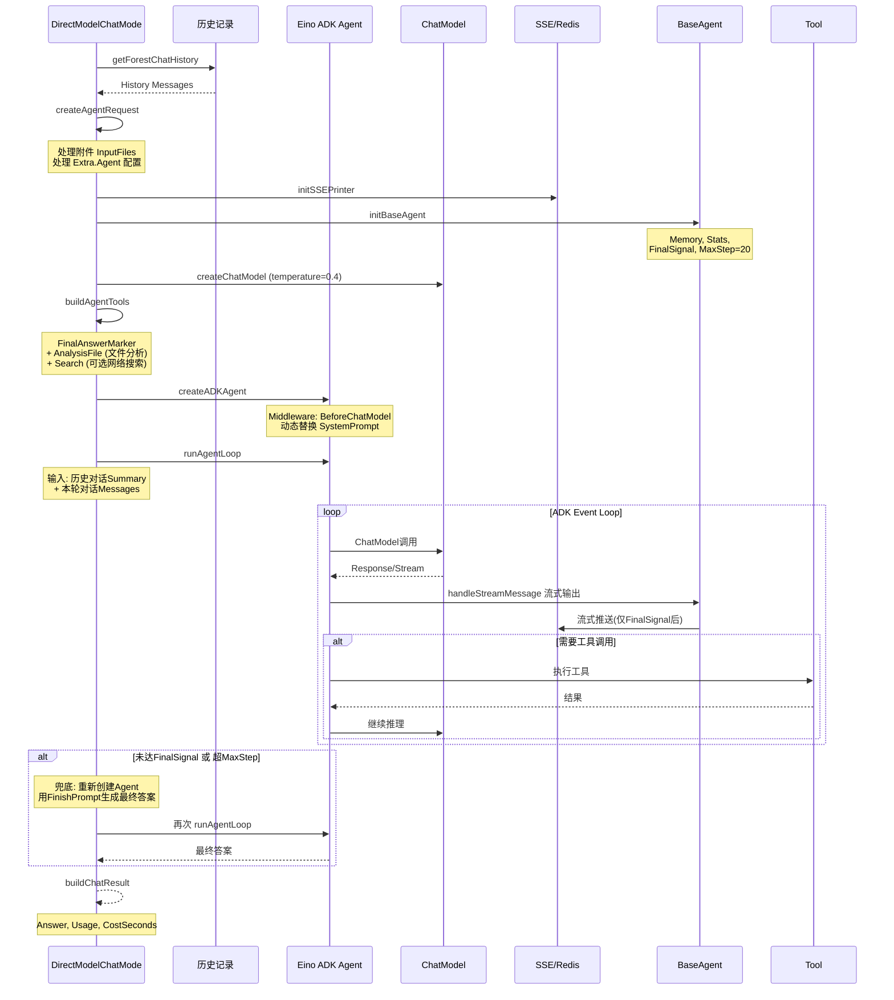

**关键特性**:
- ADK (Agent Development Kit) 架构，支持流式推理
- FinalSignal 机制：最终回复阶段才向客户端推送
- 超 MaxStep (20) 或未标记 Final 时，自动兜底生成答案
- 支持文件分析和可选网络搜索

---

### 3. GraphSearchChatMode — 图谱搜索问答

**BaseType**: `graph_search`  
**文件**: `apps/kechat/chat/modes/graph_search.go:27`

基于知识图谱的搜索问答，通过目录 Agent 和过滤 Agent 识别相关文件，再结合图谱数据生成回答。

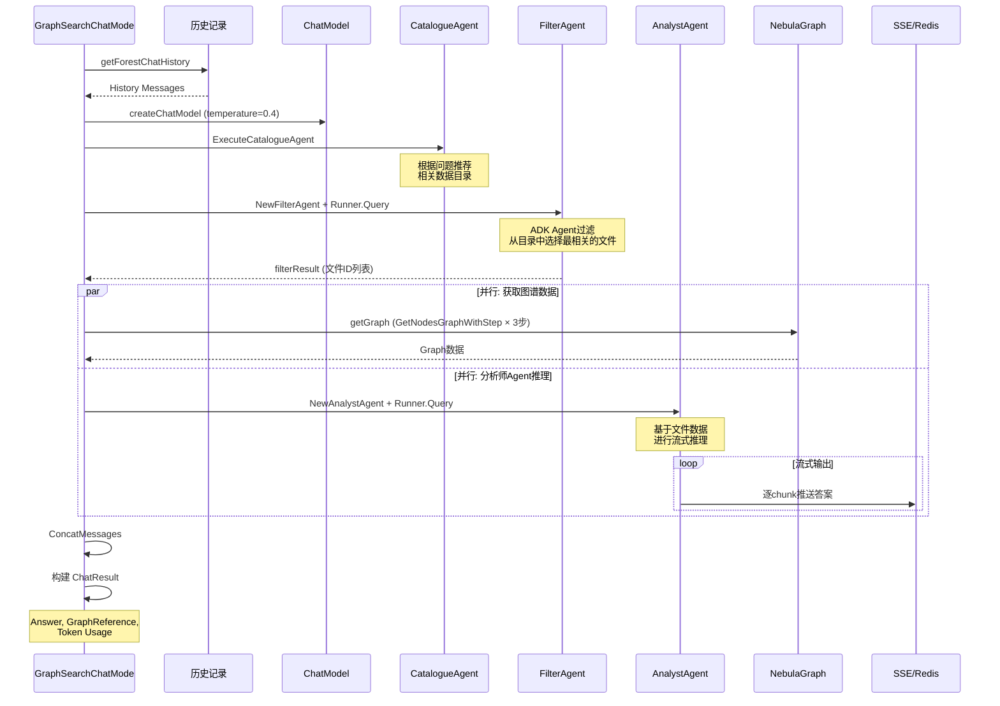

**关键特性**:
- 两级 Agent 流水线：目录推荐 → 文件过滤
- 图谱数据获取与分析师推理并行执行
- 基于 NebulaGraph 的图数据库查询
- 流式输出分析结果

---

### 4. ExcelChatMode — Excel 数据分析问答

**BaseType**: `react_excel`  
**文件**: `apps/kechat/chat/modes/excel.go:28`

针对 Excel 文件的数据分析问答，通过代码执行、文件操作、图表生成实现。

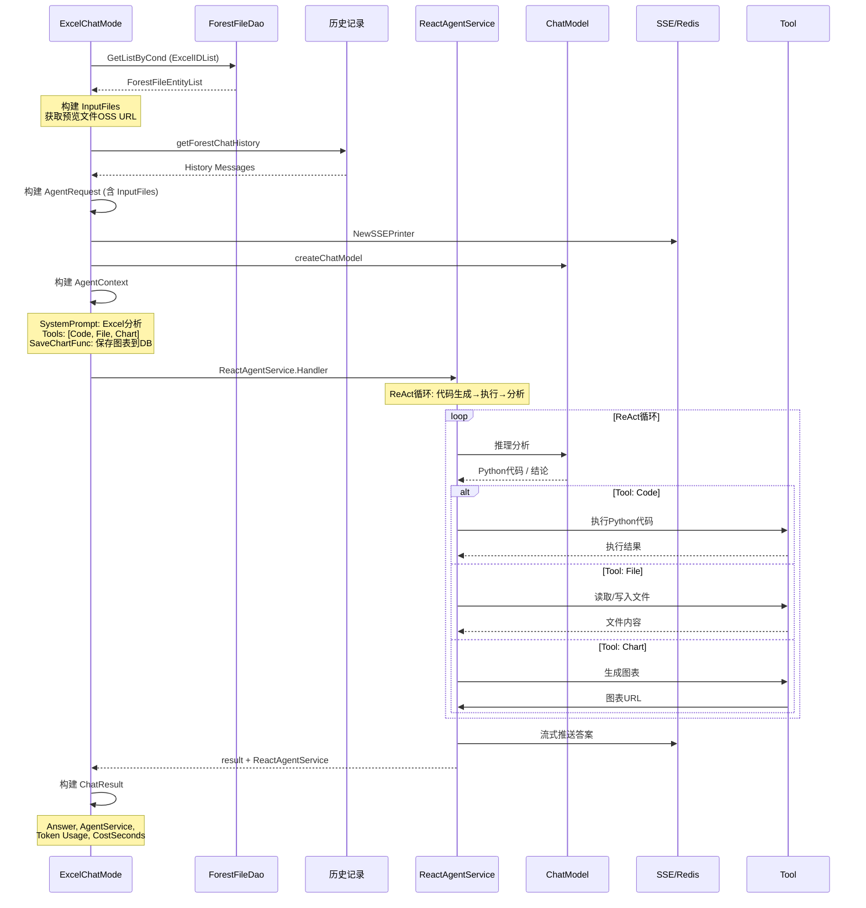

**关键特性**:
- ReAct Agent 模式，可执行 Python 代码
- 支持文件读写和图表生成（保存到 `chat_chart` 表）

---

### 5. ForestAgentChatMode — 森林 Agent 问答

**BaseType**: `forest_agent`  
**文件**: `apps/kechat/chat/modes/forest_agent.go:28`

融合知识库检索与文件分析的综合 Agent 模式，支持代码执行、文件操作。

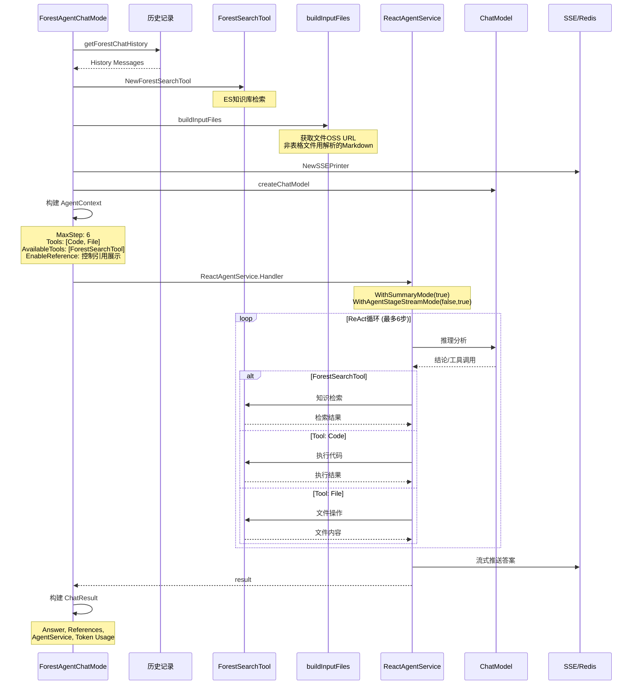

**关键特性**:
- 知识库搜索 + 多文件分析的融合 Agent
- MaxStep=6，比 ForestChatMode (4) 更灵活
- 支持 Code + File 工具
- 文件根据类型选择解析方式（表格用原始文件，其他用 Markdown）
- 通过 `WithAgentStageStreamMode(false, true)` 控制中间阶段不流式，仅最终答案流式

---

### 6. AgentChat — Coze Bot Agent 问答

**BaseType**: `agent`  
**文件**: `apps/kechat/models/qachat/agent_chat.go:25`

使用旧版架构，对接 Coze Bot 平台的 Agent 问答。

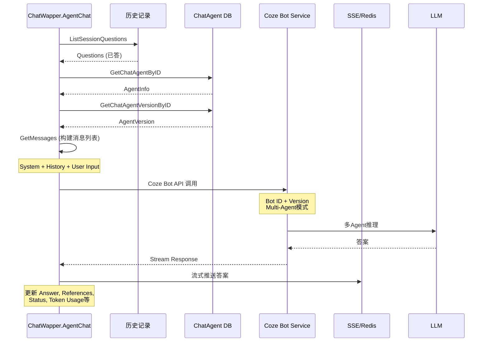

**关键特性**:
- 对接 Coze Bot 平台的 Multi-Agent 模型
- 旧版架构，直接操作 questionEntity
- 支持 Coze 的引用系统（KNode）
- 包含输入参数替换和 Bot 变量处理

---

### 7. MysqlChat — MySQL NL2SQL 问答

**BaseType**: `mysql`  
**文件**: `apps/kechat/models/qachat/mysql_chat.go`

自然语言到 SQL 的转换问答，支持多轮对话式数据查询。

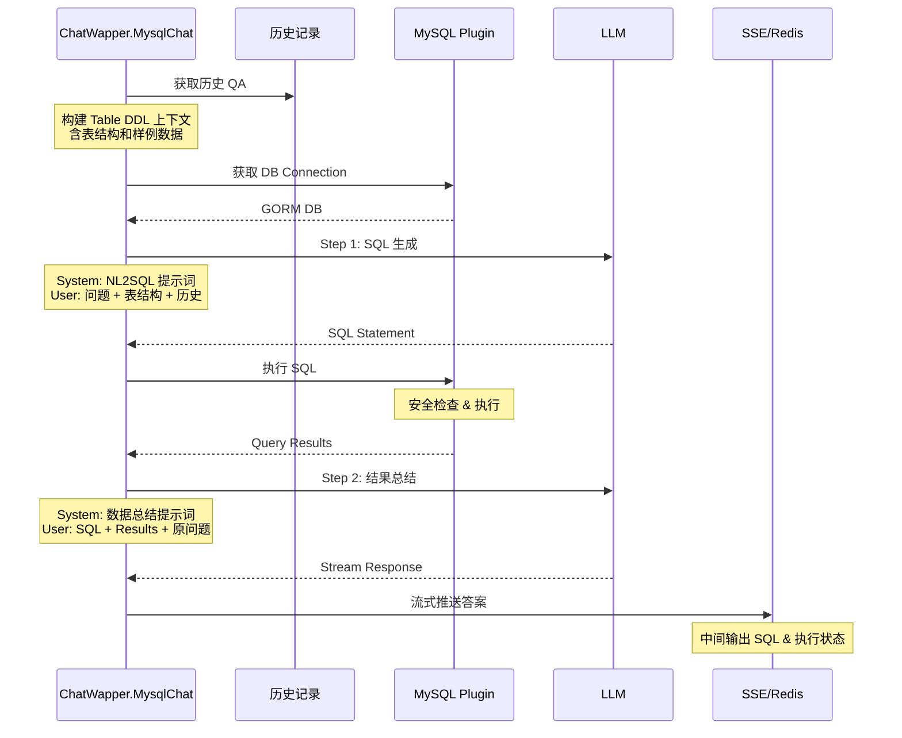

**关键特性**:
- 两步流程：NL→SQL 生成 → 结果自然语言总结
- 自动获取表 DDL 和样例数据构建上下文
- SQL 执行安全检查
- 支持多轮对话（历史 SQL 上下文）
- 流式输出 SQL 执行状态和最终答案

---

### 8. ForestGraphChat — 图谱洞察问答

**BaseType**: `graph_qa`  
**文件**: `apps/kechat/models/qachat/forest_chat.go:16`

基于知识图谱结构（森林）的洞察问答，使用搜索引用和 FAQ 匹配。

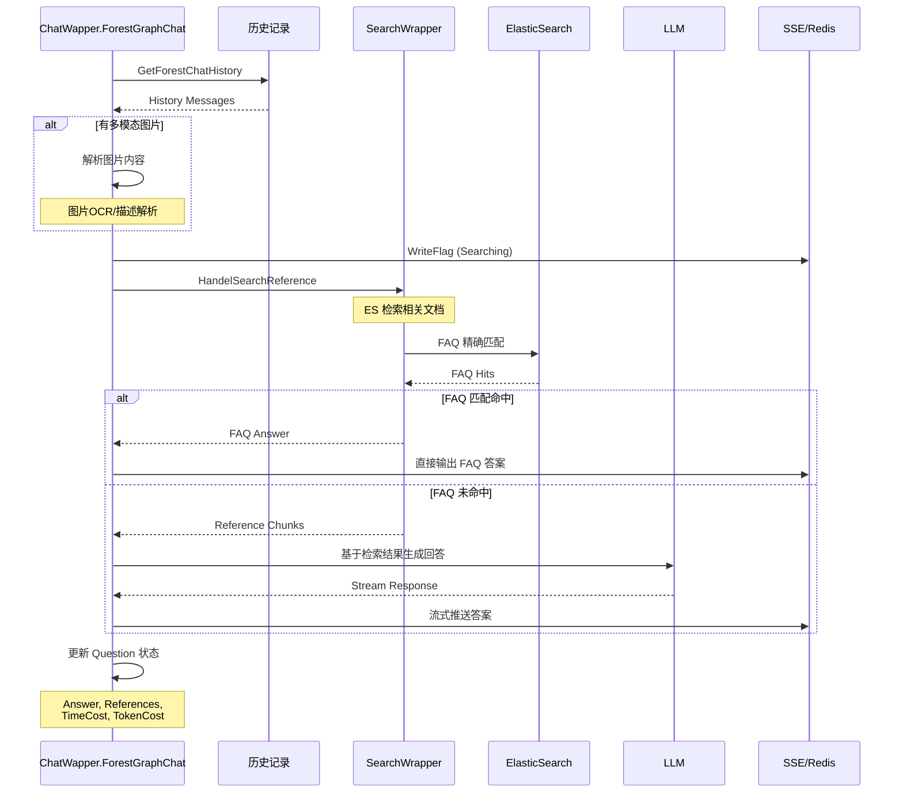

**关键特性**:
- FAQ 优先策略：先精确匹配 FAQ，命中则直接返回
- 支持图片等多模态输入解析
- ES 向量 + 关键词混合检索
- 旧版架构，直接操作 questionEntity

---

### 9. Eino ExcelChatBuilder — Excel Eino 编排模式

**BaseType**: `excel`  
**代码**: `chat.go:124` → `einochatnodes.ExcelChatBuilder`

使用 CloudWeGo Eino 编排框架构建的 Excel 分析 pipeline，通过 `compose.Runnable` 链式处理。

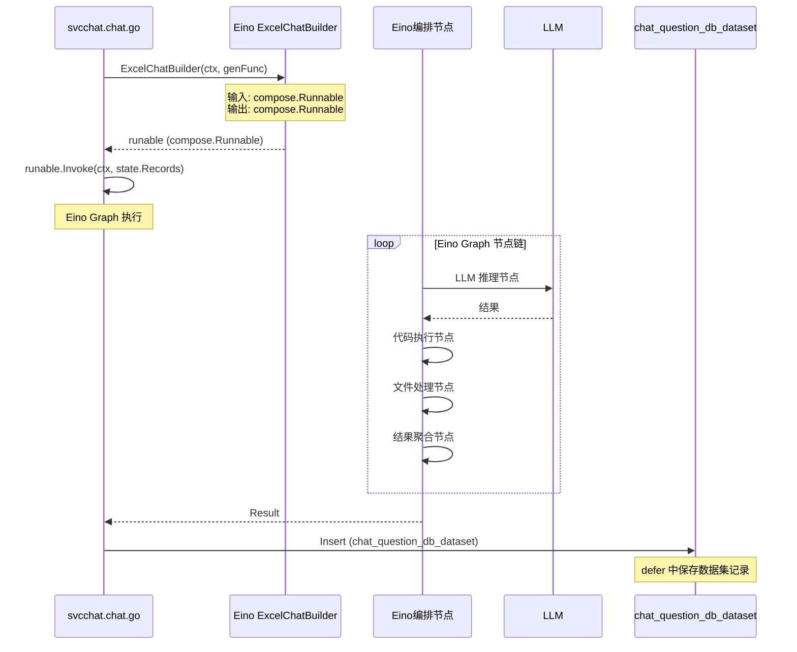

**关键特性**:
- Eino compose 编排框架，节点化 pipeline
- 与 ExcelChatMode (react_excel) 不同的实现路径
- defer 中自动记录 dataset 到 `chat_question_db_dataset` 表

---

### 10. Eino ExternalChatBuilder — 外部数据源编排模式

**BaseType**: `external_data`  
**代码**: `chat.go:132` → `einochatnodes.ExternalChatBuilder`

使用 Eino 编排框架连接外部数据源（通过 ExternalToken）进行问答。

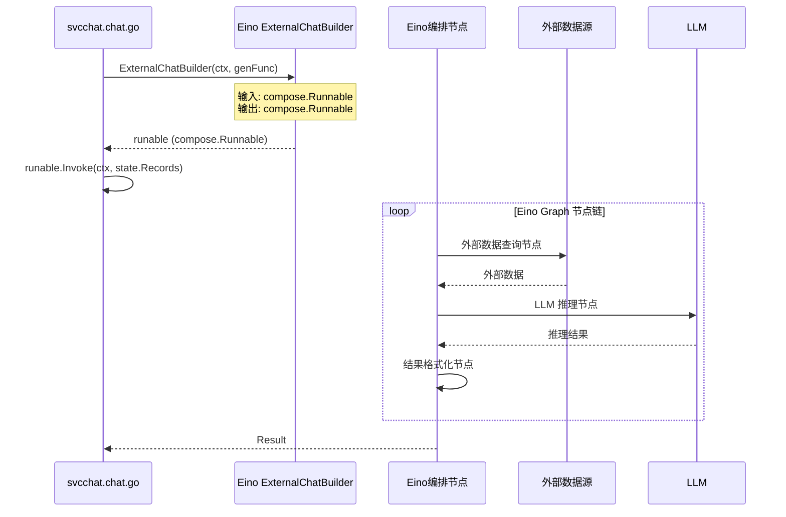

**关键特性**:
- Eino compose 编排框架
- 通过 `Session.ExternalTokenIDList` 配置外部数据源连接
- Pipeline 式数据处理流程

---

## 架构分类

`/chat.ChatQuestionStream` 当前存在**三套架构并存**的局面：

### agentwrapper/modes 模式（新架构）— 4 个 BaseType

统一 `ChatMode` 接口 + `ChatContext` + `ChatResult`，由 `ChatWrapper` 负责结果回写。

| BaseType | 实现 |
|----------|------|
| `standard` | `ForestChatMode` — 知识库 RAG + ReAct Agent |
| `model` | `DirectModelChatMode` — 直接模型对话 + ADK Agent |
| `graph_search` | `GraphSearchChatMode` — 图谱搜索 + 多 Agent 流水线 |
| `react_excel` | `ExcelChatMode` — Excel 分析 + Code/File/Chart 工具 |

### qachat 旧版模式 — 3 个 BaseType

直接操作 `questionEntity`，无统一接口抽象。

| BaseType | 实现 |
|----------|------|
| `agent` | `qachat.AgentChat()` — Coze Bot 平台对接 |
| `mysql` | `qachat.MysqlChat()` — NL2SQL 两步流程 |
| `graph_qa` | `qachat.ForestGraphChat()` — 图谱洞察 + FAQ 优先 |

### Eino 编排模式 — 2 个 BaseType

使用 CloudWeGo Eino `compose.Runnable` DAG 编排框架。

| BaseType | 实现 |
|----------|------|
| `excel` | `qachatnodes.ExcelChatBuilder` — 节点化 Excel 分析 pipeline |
| `external_data` | `qachatnodes.ExternalChatBuilder` — 外部数据源连接 pipeline |

---

## 核心数据结构（新架构）

### ChatContext（上下文）
`apps/kechat/chat/core/context.go:18`
- `Session`: 会话信息和 BaseType
- `Question`: 用户问题和源数据
- `Model`: LLM 模型配置
- `ModelOptions`: 模型调用选项
- `Extra`: 扩展数据（Printer, SummaryPrompt, EnableReference）

### ChatResult（结果）
`apps/kechat/chat/core/result.go:8`
- `Answer`: 回答文本
- `Reasoning`: 推理过程
- `Usage`: Token 用量（Prompt/Completion/Cache/Total）
- `Performance`: 性能（ReasoningSeconds/CostSeconds）
- `Status`: 问题状态
- `Meta`: 元数据（AgentService/QueryReferences/ChatReferences）

### ChatMode（接口）
`apps/kechat/chat/core/interface.go:7`
```go
type ChatMode interface {
    Run(ctx context.Context, c *ChatContext) (*ChatResult, error)
}
```

---

## 生命周期钩子

在 `svcchat/chat.go:73` 的 defer 块中执行：

1. **SubQuestion 生成**: 通过 LLM 将问答总结为简短子问题，用于历史展示
2. **SessionName 更新**: 通过 LLM 根据问答内容更新会话名称
3. **Question 状态持久化**: 更新 Answer、Status、Token 等字段

---

## 错误处理策略

```mermaid
graph TD
    A["ChatMode.Run() 返回 error"] --> B{err != nil?}
    B -->|是| C["检查 Question.Answer"]
    C -->|""| D["写入兜底错误消息<br/>llmchat.WriteContent"]
    C -->|"非空"| E["保留已有 Answer"]
    D --> F["Status = QuestionStatusError"]
    E --> F
    B -->|否| G{runable != nil?}
    G -->|nil (新版模式)| H["直接返回 (已处理)"]
    G -->|非nil (Eino模式)| I["runable.Invoke"]
    I --> J{err != nil?}
    J -->|是| C
    J -->|否| K["正常返回"]
```

---

## 总结

`/chat.ChatQuestionStream` 通过 `BaseType` 分发到 **10 种问答模式**，分为三套架构：

| 架构 | 模式数 | BaseType |
|------|--------|----------|
| agentwrapper/modes（新架构） | 4 | `standard`, `model`, `graph_search`, `react_excel` |
| qachat 旧版 | 3 | `agent`, `mysql`, `graph_qa` |
| Eino 编排 | 2 | `excel`, `external_data` |

> 注：`ForestAgentChatMode`（`forest_agent`）模式已实现但当前 `svcchat/chat.go:102` 的 switch 中未注册分发，由 `wrapper.go:40` 预留。
