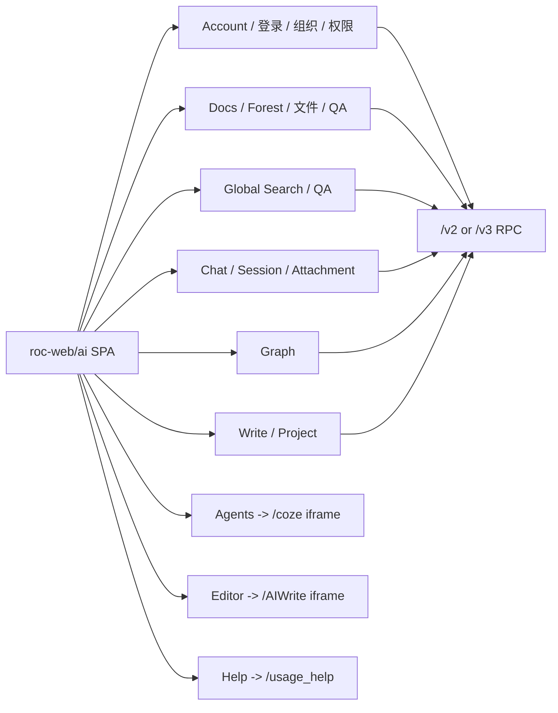
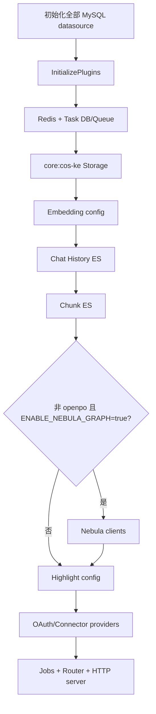
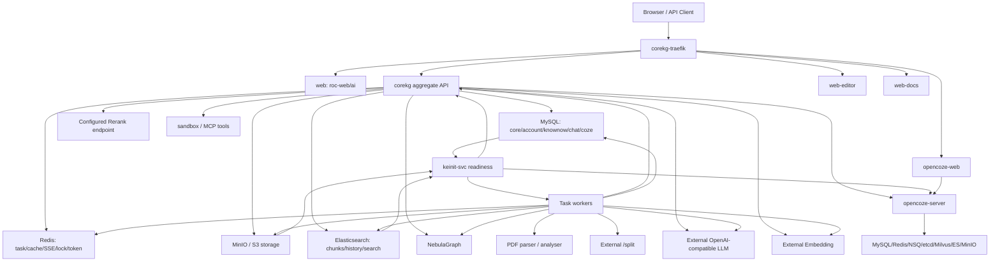
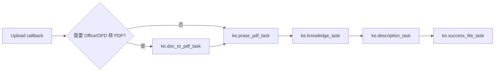
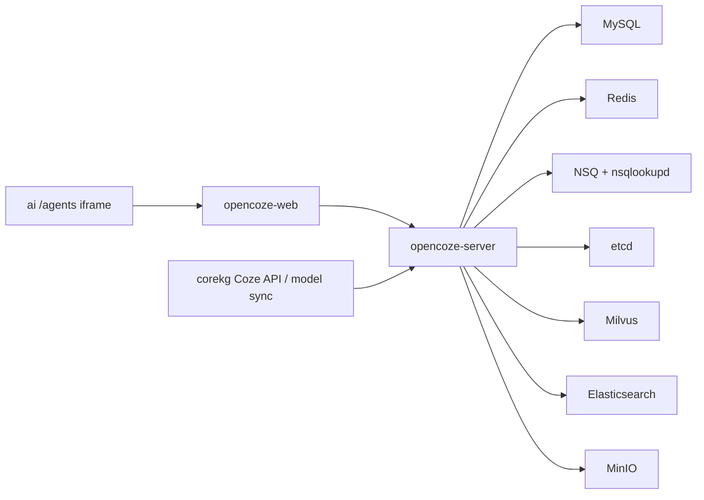

# CoreKG 代码与服务依赖分析

> 文档范围：前端仅覆盖 `roc-web/ai`；后端覆盖 `roc/apps/corekg` 聚合进程及其直接聚合的 `kecore`、`kechat`、`account`、`keapi`、`keparser`、`kesearch` 和相关公共包。运行态结论以当前测试环境事实为准。
>
> 代码基线：后端以当前测试服务对应的 GitLab MR !428（`fix(kechat): parse pdf attachments via core task`）提交 `79b2fc46419d1c4aee791d1d23576db2c0d6ebcf` 为准；前端以本地 `roc-web/ai` 提交 `ae0bd5947ab68232c688cce6382ced6272dbfda2` 为源码基线。前端基线未声明与测试环境构建完全一致，因此前端路径/行号属于“当前源码事实”，运行态配置与路由结论属于“当前运行态事实”。本文不提供镜像清单，也不包含安装、部署或环境搭建步骤。
>
> 证据日期：2026-07-10。文档不记录密码、Token、API Key 等敏感值。

## 1. 结论摘要

### 1.1 最重要的架构事实

1. **`corekg` 是进程内聚合单体，不是微服务编排壳。** `apps/corekg/app.go` 把 `kecore`、`kechat`、`account`、`keapi`、`keparser`、`kesearch` 和 `corekg` 自身 Router 注册到同一个 HTTP 进程。删除某个 Router 并不会自动取消该模块在启动阶段初始化的数据库、对象存储、ES、Embedding、Highlight、Nebula、Connectors 或 Task 依赖。
2. **运行时启动存在明确的基础设施闸门。** `MySQL + Elasticsearch + MinIO -> keinit-svc -> corekg / workers / opencoze-server`。即使 `keinit` 在业务请求阶段不承载流量，删除它也会使带相应 initContainer 的 Pod 在重启或扩容时阻塞。
3. **知识文件处理不是 `corekg` 单进程完成的。** `corekg` 负责文件元数据、任务生成、任务 Broker API、状态推进和最终收口；Redis Streams 负责触发；MySQL `core_task` 是任务事实表；多个 worker 和外部解析/分块/LLM/Embedding 服务执行实际算法工作。
4. **当前没有统一的服务热插拔框架。** 多数 CoreSetting 在启动时加载到进程级配置或客户端中，替换后需要重启；数据库、ES、存储和向量维度还涉及数据迁移。worker 可以在遵守 Task HTTP/Redis/MySQL/产物契约时横向热增容，但不能把最后一个消费者直接移除。
5. **最难裁撤的是 Account、MySQL、Redis、MinIO、Elasticsearch 和知识任务链。** 它们跨越登录鉴权、权限、文件、检索、Chat、Agent、Project、AI 写作或异步任务多个功能域。
6. **相对容易裁撤的是静态/辅助界面和已确认未被 CoreKG 当前配置选中的能力。** 例如本地 `rerank-emb` 当前未被 CoreSetting 选中；Kibana 在 `release-2.13` chart 中只是注释模板，不计入当前服务单元。但删除前仍要做调用流量和资源 Owner 确认。
7. **Coze 不是纯前端可选页。** `/agents` 当前主要嵌入 Coze Web；普通 ChatModel Create/Update 会无条件调用 Coze 同步函数，对支持 function call 或已有绑定的模型发生跨库写入。要下线 Coze，必须先解除模型管理耦合。
8. **MR !428 把 Chat 的 PDF/Office 附件解析接入 `ke.prase_pdf_task`，但 HTTP 上传仍同步等待。** 无 worker 时最长等待 10 分钟后返回 500；Task DB 创建失败会立即 500；DB 创建成功但 Redis 推送失败也会立即 500，并留下 pending 任务，依赖后续对账补推。HTTP 超时不会取消后台任务。

### 1.2 服务裁撤决策速查

| 结论 | 服务/能力 | 说明 |
|---|---|---|
| 不可直接删除 | `corekg`、MySQL、Redis、MinIO、Elasticsearch、`keinit`、`doc-analyzer`、`graphrag-chunker`、`ai-summary-worker` | 删除会导致进程无法启动、Pod 无法重启，或主知识链/Chat 附件链中断 |
| 仅可按文件类型裁撤 | `doc2pdf-worker`、`word2pdf`、`ofd2pdf`、`file-convert` | 禁止相应 Office/OFD/XLS 等格式并修改前后端校验、任务生成后才可删除 |
| 可在关闭功能并改代码后删除 | NebulaGraph、`graphrag-graph`、Coze 全栈、Sandbox、Chart MCP、AI 写作、Keapi MCP | 都有明确功能边界，但当前仍有启动、Router、配置或跨模块耦合 |
| 当前 CoreKG 直接依赖中可疑似裁撤 | `rerank-emb`、`web-docs` | 两者分别是当前未选中的本地 Rerank、帮助站；Kibana 在当前 chart 中未启用，不计入服务清单 |

## 2. 范围、证据和术语

### 2.1 范围边界

包含：

- 前端 `roc-web/ai` 的路由、API 封装、页面入口和嵌入式子系统边界。
- 后端 `roc/apps/corekg` 聚合进程及聚合 app 的路由、启动初始化、任务、存储和跨模块调用。
- 当前测试环境的服务拓扑、配置、CoreSetting、Task topic 和运行状态。
- 无源码算法服务的可见接口、任务 payload、网络目标、产物和失败行为。

不包含：

- `roc-web` 中 `ai` 目录之外的前端实现；`web-editor`、Coze Web 等只作为外部/嵌入子系统分析边界。
- 算法服务不可见的内部实现、模型权重、性能和精度保证。
- 当前镜像清单、安装、部署、升级、扩缩容命令。
- 对服务、数据库、Redis、配置或代码的实际裁撤操作。

### 2.2 证据等级

| 标记 | 含义 |
|---|---|
| `CODE` | 代码入口、分支、调用或失败行为已核对 |
| `CFG` | ConfigMap、CoreSetting 或环境变量事实，敏感值已省略 |
| `RUNTIME` | 服务资源、Redis Task、MySQL 状态或安全日志事实 |
| `CONTRACT` | 无源码服务的输入、输出或回调契约可从调用方确认 |
| `INFERENCE` | 基于无直接引用、拓扑或命名的推断，不能作为直接删除依据 |

### 2.3 插拔等级

| 等级 | 定义 |
|---|---|
| `H0 不可插拔` | 当前是启动或核心数据链硬依赖；删除会使主服务不可用 |
| `H1 冷替换` | 有接口或存储抽象，但需停机/迁移数据、改配置并重启 |
| `H2 功能级冷插拔` | 可关闭某项产品功能后删除，但必须同步改代码、配置、路由或任务 DAG |
| `H3 契约级可插拔` | 可按既有 HTTP/Task/OpenAI-compatible 契约替换实现；配置切换通常仍需重启 |
| `H4 热扩缩` | 同实现消费者可在线增加或减少实例；不代表可删除最后一个实例 |

本文没有把“Service 是 HTTP 调用”误判为“热插拔”。真正热插拔要求调用方在依赖消失时仍能稳定降级，并且不需要重启或数据迁移；当前只有 worker 横向扩缩和部分模型实例选择接近这一能力。

## 3. 全体代码架构

### 3.1 前端 `ai`

前端是 React/Vite SPA。`ai/src/router/index.tsx:163-451` 定义主要产品入口；`ai/src/api/request.ts:140-148` 统一发送 RPC 风格请求；`ai/src/config/index.ts:17-24` 决定 API 前缀，其中 `account.*` 使用 `/v2` 兼容入口，其余主要使用 `/v3`。



主要页面边界：

| 主要 API/后端域 | 关键服务边界 | 前端入口 |
|:--|:--|:--|
| `account.*` | Account DB、Redis、对象存储、OAuth Provider | `/login`、`/auth`、`/settings/profile`、`/settings/organization`、`/personnel` |
| `forest.*`、知识文件 API | MinIO、MySQL、Redis Task、解析/转换 worker、ES、Embedding | `/docs/**` |
| `kesearch.*`、Forest Search、Chat | ES、Embedding、可选 Rerank、LLM | `/search`、`/QA`、`/global` |
| `chat.*`、`forest.*` | Chat DB、历史 ES、Redis SSE、LLM、Forest 检索 | Chat 组件、`/project/:id/*` |
| Coze iframe；仍保留部分本地 Agent API | Coze Web/Server 及其存储栈、ChatModel/Coze DB 同步 | `/agents` |
| `forest.*` Graph API | NebulaGraph、图任务、ES/对象存储 | `/graph/**`、`/docs/:id/knowledge-graph` |
| Article/AI Write、`/AIWrite/` | ChatModel/LLM、Redis SSE、Forest Search、web-editor | `/write`、`/editor/:id` |
| External Chat/Embed API | Account/External Token、Chat、LLM、可选 Coze | `/iframe/**` |

前端标准文件上传不是把整个文件直接 POST 给 `corekg`，而是 `forest.PreUploadFile -> 浏览器 PUT 对象存储 -> forest.UploadFileCallBack`。因此替换对象存储时不仅要兼容后端 SDK，还要兼容浏览器预签名 URL、CORS、上传完成回调和 public/signed URL 的读取行为。

### 3.2 后端 `corekg` 聚合进程

`apps/corekg/app.go:35-46` 注册以下 app：

| 聚合 app | 主要职责 | 是否可仅删 Router 完成裁撤 |
|---|---|---|
| `kecore` | Forest、文件、文章、Project、图谱、CoreTask | 否；启动和其他模块广泛引用 |
| `kechat` | Chat、Session、Agent、Model、Attachment、Coze | 否；Keapi Chat、AI 写作和 Project 依赖 |
| `account` | 登录、组织、员工、权限、API Key、OAuth | 否；是所有业务身份上下文底座 |
| `keapi` | 对外 REST API 与 MCP Server | REST/MCP Router 可拆，但 Chat/Account 依赖需分别处理 |
| `keparser` | Task 领取、回调和健康接口 | 名称不是 PDF parser；聚合后是 worker Broker API |
| `kesearch` | 检索、全局搜索 | 否；依赖 ES/Embedding，并被 Chat/前端使用 |
| `corekg` 自身 | 系统、配置、任务收口等 API | 否 |

启动链位于 `apps/corekg/cmd/main.go:60-184` 和 `apps/corekg/cmd/init.go:23-68`：



关键语义：

- MySQL、多数据源、`core:cos-ke`、Embedding/ES/Highlight/Connector 配置加载失败会阻止启动。
- Redis 初始化失败只记录错误并继续，但后续 Task、SSE、登录锁、Token 和部分代码直接取 Redis Client，可能报错或 panic，不能视为可选依赖。
- ES Client 构造不等同于网络健康检查；进程启动成功不代表请求期 ES 可用。
- Nebula 的环境开关只包住 `corekg` 的部分初始化，worker、Graph Router、任务生成和数据清理不都受该开关保护。

## 4. 运行时服务架构

### 4.1 入口与路由

`corekg-traefik` 是当前统一入口。已验证路由关系：

| Path | 后端 |
|---|---|
| `/v2/`、`/v3/` | `corekg:8080` |
| `/` | `web:80` |
| `/AIWrite` | `web-editor:80` |
| `/usage_help` | `web-docs:80` |
| `/coze` | `opencoze-web:80`；Web 内部再代理 API 到 `opencoze-server:8888` |
| `/corekg-bucket`、`/opencoze` | `minio:9000` |
| `/score`、`/v1` | `rerank-emb` |
| `/forms/libreoffice` | `word2pdf:3000` |
| `/v4/html-to-docx` | `html2docx:8000` |
| `/v3/status` | `keinit-svc:8080` |

### 4.2 总体依赖图



### 4.3 启动闸门

`keinit` 等待 Elasticsearch、MinIO、MySQL；`corekg`、`ai-summary-worker`、`doc-analyzer`、`doc2pdf-worker`、`graphrag-chunker`、`graphrag-graph` 的 initContainer 等待 `keinit-svc`；`opencoze-server` 还等待 MySQL、Redis、NSQ、Elasticsearch、MinIO、Milvus。

结论：

- `keinit` 是**重启/扩容路径硬依赖**，不是普通请求期依赖。
- 已运行 Pod 在删除 `keinit` 后可能暂时继续工作，这不能证明可裁撤；下一次重启会暴露故障。
- `keinit-svc` 通过不等于所有初始化副作用成功：MinIO 普通 bucket/Coze bucket 创建在重试耗尽后仍继续启动 HTTP `status.Ping`。因此它是硬闸门，但健康端点不是 bucket 初始化完成的充分证明。
- 要去除 `keinit`，必须先移除所有 initContainer 闸门，并把数据库迁移、CoreSetting 种子、模型/配置初始化的职责迁移到可审计的独立流程。

## 5. 按功能分析端到端依赖

### 5.1 登录、身份、组织和权限

链路：

```text
ai /login、/settings、/personnel
  -> account.* (/v2 compatibility path)
  -> Account Router / middleware
  -> account MySQL + Redis + image/logo storage
  -> request context: uin/company_id/employee/role/permission/quota
  -> kecore / kechat / keapi 后续业务
```

依赖和失败：

- Account MySQL 是启动期和请求期硬依赖；普通登录态和 API Key 鉴权都会查询它。
- Redis 用于登录尝试锁定、Refresh Token 等；Redis 故障不只影响缓存。
- `account:pkl_connect_providers` 在 `corekg` 启动时加载。当前配置为空，说明没有已配置的 OAuth Provider，但初始化代码仍存在。
- 组织成员变更后的 Coze Space/Member 同步是最佳努力；同步失败不回滚组织主数据。因此“组织管理”可与“Coze 组织同步”拆开，但不能与 Account 本身拆开。

裁撤结论：`Account = H0`。如果要构建无账号的私有单租户版，需要重写所有登录 middleware、Runtime identity、Forest/Agent/Project 权限、API Key、配额和前端鉴权路由，而不是删除 `apps/account` Router。

### 5.2 管理与辅助功能

这些页面多数不对应独立业务服务，但部分会改变主链的 MySQL、ES、Redis、LLM 或外部 API 依赖，不能全部归为“后台 CRUD”。

#### License

Custom 模式下，前端 `LoginGlobalProvider` 启动即调用 `corekg.GetLicenseInfo`；结果未返回时整个应用保持 Skeleton。后端 `apps/corekg/internal/apis/apis.go:9-14` 暴露 License API，全局 Router 还安装 License middleware；Register 写 CoreSetting/raw license 并更新 Account/website info。

因此 License 是当前 custom 前端壳层和后端 middleware 的横切依赖。去 License 必须同时修改前端启动 gating、Auth/License 页面、模块许可判断、后端 Router/middleware 和 CoreSetting，属于 `H2` 冷裁撤，不是只删页面。

#### 订单、支付、配额与 Usage

- 前端始终注册 `/settings/order-management`，但侧栏仅对 SaaS 管理员显示；API 位于 `ai/src/api/pay.ts`。
- `corekg` 聚合进程虽然注册 `ListPackage/CreateOrder/QueryOrderStatus/...`，却没有调用独立 `kecore` 启动器中的 `kesale.Init`。因此“Router 存在”不代表当前支付 client 已初始化，微信支付不能列为当前 CoreKG 有效运行依赖；CreateOrder 反而可能因 client 未注册而失败。
- 若未来启用支付，才会新增外部微信支付 API/入站 callback、MySQL 和 Redis callback lock 依赖。
- `/settings/profile/usage` 当前是 mock 页面。真实 SaaS quota 通过 `forest.GetCommonInfo` 聚合 MySQL 资源统计，并因 QA 用量读取 ES；当前 custom 版本跳过该轮询并使用默认 quota。

支付可协调删除前端订单/购买 UI、`pay.ts`、后端 sale routes/service，不对应任何当前运行服务的删除。Quota 则与 Forest/QA 数据共享 MySQL/ES，不能靠移除 Usage 页面裁掉基础设施。

#### `/version` 申请入口

公开 `/version` 不是纯静态页：发送验证码依赖外部 SMS Provider 和 Redis；提交依赖 Redis 验证码、Account MySQL 和外部企业微信机器人 webhook。它可独立按 `H2` 裁撤：同步删除 route、`VersionUpgradeSendCode/Verify` 前端 API、后端 handler 和相关配置，不影响知识库主链。

#### 同义词与行业术语

前端设置页对应 `synonym`、`industry-term` API，但它们还位于 Forest Chat 热路径：每次问题会先 `ReplaceSynonymKeywords`，再 `ReplaceMajorKeywords`；两者分别调用当前 ChatModel 做一次关键词抽取，再查询 MySQL，错误时回退原问题。

结论：

- 只删除管理 UI 不会解除 Chat 对 LLM/MySQL 的该部分依赖；
- 完整裁撤必须先删除 `apps/kechat/chat/modes/forest.go` 中两次 replace 调用，再删除 `devkeywords`/`svckeywords`/`forestkeywords`、Router 和前端 API；
- 当前无 Feature Flag，属于 `H2`，不是热插拔；
- 该链会让每次 Forest Chat 额外发生最多两次 LLM 关键词请求，应纳入容量和超时分析。

#### 标签、公告、消息与品牌信息

- 标签/标签组是 MySQL 内部能力，无独立服务。可协调删除管理 UI、Router、Model/资源映射；如果业务列表仍保留 tag 字段，可只删除管理页面。
- 公告和未读消息直接查询 MySQL DAO；前端每 60 秒轮询未读数。删除不对应任何独立运行服务裁撤。
- `account.GetGlobalInfo` 读取 website-info，失败时前端可回退 ConfigMap。组织/网站 Logo 上传使用对象存储；即使删除品牌自定义，MinIO 仍被知识文件主链使用，只能清理 Logo purpose/config，不能删除存储服务。

#### Personnel 与企业微信 callback

Personnel 主数据依赖 Account MySQL，并被 Agent 权限选择器等复用；组织/Logo 变化到 Coze 的 Space Sync 是 best effort，Coze 下线后人员主数据仍可用。因此 Personnel 不是可随 Coze 一起删除的附属模块。

`pkgs/apis/wecom` 是另一条外部企业微信 callback Router：当前主要做验签/解密和消息记录，前端 `ai` 没有直接调用。它可以冷移除 `apps/corekg/app.go` 的注册和该 package，而不影响人员目录；不要与前端员工微信绑定/Login API 混为同一能力。

### 5.3 知识库文件上传与入库

前端标准链路：

```text
forest.PreUploadFile
  -> browser PUT 到对象存储
  -> forest.UploadFileCallBack
  -> core_upload_files / knownow_forest_file
  -> CreateForestTask
```

后端任务 DAG：



代码证据：`apps/kecore/models/coretask/generate_task.go:25-115,137-223,251-392`。任务先全部写入 MySQL，只把第一个可执行 step 推入 Redis；成功回调再推进下一 step。

| Step | 当前执行单元 | 主要输入/输出 | 强依赖 |
|---|---|---|---|
| `ke.doc_to_pdf_task` | `doc2pdf-worker` | 原文件 -> PDF preview | MinIO、`word2pdf`/`ofd2pdf`、corekg callback |
| `ke.prase_pdf_task` | `doc-analyzer` | PDF -> `content.md` 等目录产物 | MinIO、外部 PDF parser、corekg callback |
| `ke.knowledge_task` | `graphrag-chunker` | Markdown -> chunks/index | 外部 `/split`、ES、Embedding、MinIO，当前 worker 配置还涉及 Nebula |
| `ke.description_task` | `ai-summary-worker` | chunk/文档 -> 摘要、描述、推荐问题 | ES、LLM、Embedding、corekg callback |
| `ke.success_file_task` | `corekg` 内部 job | 更新文件和 Forest 最终状态 | MySQL、Task API、Redis |

补偿模型不是分布式事务：

- Redis Stream 只作“有某类任务可领取”的触发，MySQL `core_task` 才是任务事实。
- worker 通过 `FOR UPDATE SKIP LOCKED` 领取任务；Redis `XReadGroup` 使用 `NoAck`。
- callback 没有 worker 侧持久重试；失败后 running task 通常要等待超时扫描。
- fail 可按 redo 次数重新入队；默认重试边界由 `task_config_redo` 控制。
- success 后推下一 step 失败只记录日志，不回滚已经成功的 step，依赖周期对账补推。
- DB 事务无法覆盖 MinIO、ES、Nebula，可能存在孤立对象或部分索引。

裁撤结论：主知识链整体为 `H0`；单个 worker 只能在重写 DAG 或禁用相应文件/产品能力后按 `H2/H3` 裁撤。

### 5.4 特殊知识库与可视化

#### Excel/CSV 表格库

Excel/CSV 与普通 PDF 文档不是同一条任务链：

- 创建 Excel Forest 时，后端读取 `knowledge:mysql_excel_instance` 并创建 `ke_excel_<company>` MySQL database（`apps/kecore/services/svcforest/forest_api.go:110-173`）。因此该 CoreSetting 是“创建表格库”的硬依赖。
- 当前预签名上传回调对 Excel/CSV 不创建 CoreTask，而是异步把 parse、mindmap、analysis、knowledge、graph、description 状态全部置为 success（`apps/kecore/services/svcforestfile/forest_file_upload.go:383-423`）。旧 deprecated `forest.UploadFile` 才调用 `AnalyzeXlsx`。
- 当前 React Excel Chat 读取对象存储中的预览文件，调用外部 LLM，并注册 Code/File/Chart 工具；依赖 MinIO、Redis SSE、Sandbox、Chart MCP。Sandbox 工具初始化失败会直接终止该模式，不是无工具降级。
- `file-convert` 只用于 `.xls -> .xlsx` 和 Strict OOXML `.xlsx -> Transitional .xlsx`；普通 `.xlsx` 不调用它，CSV 预览由进程内 `excelize` 转换。因此删除 `file-convert` 只需要禁用 `.xls` 和 Strict OOXML，不应把所有 Excel/CSV 都判为不可用。
- 前端仍保留 `/docs/excel/:id` 和后端旧 SQL Excel/sheet 路径，但主列表已不再导航到该路由，新上传也不生成旧 sheet/table 数据。该双轨可作为遗留候选，删除前必须查询既有 Excel sheet/table 数据。

重要缺陷：当前预签名上传可能在没有真正分析/建表的情况下把多个处理状态置为 success。状态为 success 不能证明 Excel 内容已完成可查询建模。

#### DB Knowledge

前端 `/docs/db/:id/*` 调用 `forest.Create/Get/Modify/TestForestDBInstance`、数据库/表/元数据 API；后端 Router 位于 `apps/kecore/internal/apis/apis.go:144-151`。

该能力不走 CoreTask、ES 文档 RAG、MinIO、Nebula、Sandbox 或 `file-convert`。其直接依赖是：

- CoreKG 主 MySQL 保存加密后的目标连接元数据；
- 用户提供的外部 MySQL，查询和每日 `SyncMysqlTable` 都会直连；
- 外部 LLM 用于 MySQL Chat/SQL 生成；
- 通用 Chat 层仍使用 Redis SSE 和 Chat History ES。

目标数据库是租户动态配置，不是固定内置服务。DB Knowledge 可按 `H2` 整体关闭，而不影响普通文档 RAG；必须同步删除定时同步 job、连接元数据、DB Chat、前端路由和凭据管理。

#### QA Library

QA Library 的 CRUD/import 直接把 FQA 写入 Elasticsearch：Create/Commit/Modify 需要 Embedding，List/Delete 主要依赖 ES；它不走 CoreTask、MinIO、Nebula、Sandbox 或 `file-convert`。Chat 使用时再叠加 query Embedding、可选 Rerank、外部 LLM、Redis SSE 和 Chat History ES。

它是可独立关闭的 `H2` 功能，需同步处理 `/docs/qa/:id`、`ai/src/api/knowledge.ts` 的 QA API、`apps/kecore/internal/apis/qapair`、FQA index 数据和 Chat 的 QA/FQA 搜索分支。

当前导入契约存在不一致：前端文案声明 XLSX/CSV，Dragger accept 还包含 XLS，但校验只允许 `xlsx/csv`；后端统一用 `excelize.OpenReader`。因此 CSV 通常无法按声明解析，XLS 又会被前端校验拒绝。

#### CAD

CAD 当前更接近遗留 UI 类型，不存在独立 CAD 算法服务：

- 后端主要只保留 `ForestTypeCAD` enum、创建校验和 Resplit 接受分支，没有独立 CAD parser/worker。
- 前端保留 `/docs/cad/**` 和既有卡片跳转，但新建类型列表不包含 CAD，Project 数据源明确跳过 CAD；CAD 上传 UI 只允许 PDF。
- 既有 CAD Forest 本质仍走普通 PDF CoreTask，因此依赖 `doc-analyzer`、chunk/description worker、MinIO、Redis、MySQL、ES/Embedding，不依赖独立 CAD 服务或 `file-convert`。

裁撤前先迁移既有 `forest_type=cad`，再删除前端 CAD 路由/目录和后端 enum/校验；不能把服务清单中的未知名称直接归为 CAD 依赖。

#### WordCloud / Knowledge Graph View

词云读路径使用 MySQL Forest metadata 和 Nebula 直查，不依赖 ES、MinIO、Redis、Sandbox 或 `file-convert`；数据生产仍依赖上游图任务/worker。前端路由是 `/:id/wordcloud` 和 `/:id/knowledge-graph`。

风险：前端在 API 空结果或异常时会显示硬编码 mock 词云（`ai/src/pages/app/docs/detail/components/WordCloud.tsx:100-168`），可能掩盖 Nebula/Graph 故障。删除 Nebula 时必须同步删除这些入口和 mock fallback，不能以“页面仍有词云”作为服务健康证据。

### 5.5 MR !428 Chat 附件解析

该链与普通 Forest 入库共用 `ke.prase_pdf_task` worker，但不会继续进入 chunk、description 和 success-file：

| 格式 | 处理 |
|---|---|
| PDF | 创建 `ke.prase_pdf_task` |
| DOC/DOCX/OFD/PPT/PPTX | 先 `FileToPDF`，再创建 `ke.prase_pdf_task` |
| TXT/MD/LOG/JSON | 不建解析任务，原内容按文本处理 |
| 其他允许格式 | 调用 `corekg:yg_api_analysis_file` 外部 analyser |

关键行为位于 MR 基线的 `apps/kechat/services/svcfile/attachment_parse.go`：

- `task.CreateTask` 先写 MySQL，再推 Redis，两步不在同一事务。
- 无 worker 消费时，上传 HTTP 请求每 2 秒查询一次，最长等待 10 分钟后返回 500。
- Task DB 创建失败会立即返回 500；如果 DB 已创建但 Redis `XADD`/push 失败，同样立即返回 500，同时保留 pending `core_task`，依赖周期对账再次推送。
- Task 成功后继续探测 `content.md` URL 最多 30 秒；`httptools.Get` 会拒绝非 2xx，但 `checkOutput` 只尝试读取 1 byte，并把空 2xx body 的 `io.EOF` 视为可接受，所以这不能证明产物非空或内容有效。
- HTTP 超时不会取消后台任务；转换/解析失败也不会自动删除已经上传的原文件。
- PDF task payload 读取 S3 bucket，因此这条链不能只通过 Storage interface 无修改切换到不具备 S3 语义的本地存储。
- Markdown 进入模型时单文件最多内联 80 KB；PDF 可读是因为前一步转换为 Markdown URL。

如果删除 `doc-analyzer`：

1. Forest PDF/Office 入库停在 parse step；
2. MR !428 的 PDF/Office Chat 附件上传长时间等待后失败；
3. TXT/MD/LOG/JSON 仍可保留；其他格式是否可用取决于外部 analyser；
4. 必须同步修改 `file_api.go`、`svcfile/attachment_parse.go`、Attachment DTO/状态、前端 `AttachmentList` 和允许格式提示。

### 5.6 搜索、RAG 与 Chat

`ChatQuestionStream` 主链：

```text
chat.ChatQuestionStream
  -> Chat history ES 读取问题
  -> chat MySQL 加载 Session / Model / Agent
  -> wrapper / legacy QA / Eino graph 分发
  -> Forest Search / ES recall / optional rerank / LLM
  -> Redis SSE 输出
  -> defer: 子问题、Session 名称、历史等副作用
```

关键依赖：

| 依赖 | 用途 | 降级性 |
|---|---|---|
| Chat MySQL | Session、Model、Agent、映射 | 无法降级 |
| Chat History ES | 历史问题和消息 | 主链强依赖 |
| Chunk ES | 向量/关键词召回、FQA、描述 | Forest RAG 强依赖 |
| Embedding | query/document 向量 | RAG 强依赖 |
| Rerank | 候选重排 | 可通过 `enable_rerank=false` 关闭，保留 ES recall/fallback |
| LLM | 回答、rewrite、summary、命名 | Chat 核心依赖；接口是 OpenAI-compatible |
| Redis SSE | 流式输出、请求状态 | 流式 Chat 强依赖 |
| Nebula | Graph Search/图谱增强 | 可按功能拆，但当前开关不完整 |

本地 `rerank-emb` 当前不是 CoreSetting 中选中的 Rerank endpoint；`knowledge:rerank` 指向外部服务。因此：

- 从当前 CoreKG 直接依赖看，本地 `rerank-emb` 可列为裁撤候选；
- 它仍由 Ingress 暴露 `/score`、`/v1`，可能有仓库外调用方；必须先验证访问日志/调用方，不能仅凭 CoreSetting 删除；
- 真正关闭 CoreKG Rerank 应先把 `reranksearchcfg.enable_rerank` 设为 false，并验证召回质量，而不是删除本地 Deployment。

### 5.7 图谱

前端 `/graph/**` 和知识库 Graph 页面依赖后端 Graph API、NebulaGraph 和图任务。当前普通 `CreateForestTask` 中 mindmap/analysis/graph step 已注释，但 `ke.graph_file_task` topic 与 `graphrag-graph` worker 仍存在。

`ENABLE_NEBULA_GRAPH=false` 只跳过 `corekg` 主进程的一部分初始化，不能完整关闭：

- worker 仍可能主动连接 Nebula；
- Graph Router、前端路由和数据清理逻辑仍存在；
- 既有图数据、文件状态和任务记录仍需迁移或清理策略。

完整裁撤需要：

1. 关闭前端 `/graph/**`、知识库 Graph/关系搜索入口；
2. 取消 Graph API Router 和 `kecore`/`kesearch` 图检索调用；
3. 停止创建 `ke.graph_file_task`，处理在途任务；
4. 从 chunk/graph worker 配置和代码中去掉 Nebula PreRun；
5. 定义既有图数据保留、导出或删除策略；
6. 最后移除 Nebula Graphd/Metad/Storaged 和 CoreSetting。

因此 Nebula/Graph 当前为 `H2`，不是单开关热拔。

### 5.8 Agent、模型与 Coze

当前 `/agents` 主入口嵌入 `/coze/space/:subjectId/develop`；仓库仍保留本地 Agent 页面/API 和 Embed 页面。模型调用统一走 OpenAI-compatible 语义，主要运行参数是 `model_url`、`model_name`、`api_key`。

ChatModel Create/Update 的耦合顺序：

```text
Create/Update ChatModel
  -> 提交 chat DB
  -> SyncCozeModelInstance 写 coze DB
  -> 两个 DB 无统一事务
```

Create/Update 会无条件调用同步函数；不支持 function call 且没有 Coze 绑定时函数会直接跳过，对支持 function call 或已有绑定的模型才发生 Coze DB 写入。Delete 仅在已有 `CozeModelID` 时操作 Coze。发生跨库写入时没有统一事务，因此同步失败可导致 API 返回失败但 ChatModel 已写入，删除也可能产生反向不一致。Coze 不能在当前代码下直接拔除。

Coze 栈关系：



下线 Coze 的安全顺序：

1. 解除 ChatModel Create/Update 对 `SyncCozeModelInstance` 的无条件调用，并处理已有绑定模型的 Delete 分支；增加 feature flag 或 outbox/补偿边界；
2. 替换/删除前端 `/agents` Coze iframe、Coze direct API 和登录跳转；
3. 删除 Coze Chat、Plugin、Workflow、External Token/Conversation、Space/Member sync；
4. 处理本地 Agent/ChatModel 数据与 Coze ID 映射；
5. 关闭 `/coze` Ingress；
6. 最后按依赖逆序移除 Coze Web/Server、NSQ、Milvus、etcd 等资源。

Coze 为 `H2`。模型 endpoint 本身可按 OpenAI-compatible 契约替换，接近 `H3`，但系统默认模型和缓存仍需验证是否要求重启。

### 5.9 AI 写作、Article、Project 与 Editor

- `kecore` 同时保留旧 `forest.AIWrite` 和新 `forest.ExecuteAIWriteCmd`，删除旧接口不等于删除 AI 写作。
- 新写作会选择优先级最高的系统 ChatModel，再调用 OpenAI-compatible LLM。
- Forest 引用搜索失败时可以退化为无引用生成；历史写入失败只记录 warning。
- Project 与 Chat Session `subject_id`、默认 ForestQA/AgentQA 项目绑定，不是独立 CRUD。
- 前端 `/editor/:id` 嵌入 `/AIWrite/` 的 `web-editor`；`web-editor` 源码不在本次 `ai` 范围内，内部对 `html2docx` 等依赖只能标记为边界事实。

若只关闭 AI 写作而保留 Article CRUD：

1. 删除/隐藏前端 `/write` 生成入口和编辑器 AI 命令；
2. 同时取消新旧两套 AI Write API；
3. 保留 Article/History CRUD、权限、配额和人工编辑；
4. 若删除 `web-editor`，还要移除 `/editor/:id` 和 `/AIWrite` 路由；
5. 不应直接删除 Project，除非迁移 Session `subject_id` 和默认项目关系。

### 5.10 Keapi REST 与 MCP

- Keapi REST 提供 Forest、File、Chat、Search，统一通过 Account API Key 鉴权。
- Keapi Chat 直接使用 `forest_agent`，依赖 Kechat、Forest Search、ChatModel、ES/Embedding/LLM。
- Keapi MCP Router 可与 REST 分开删除；但 MCP Chat tools 仍复用上述 REST/Chat 能力。
- 聚合 `corekg` 注册了 MCP Router，却没有调用 `keapi/conf.InitMCPCfg`；MCP 内部 HTTP callback 默认仍是 `http://localhost:8086`。在没有独立 keapi 监听该端口时，Router 可见但 Tool 执行可能失败。
- Agent 侧 MCP Client 来自 `corekg:agentenv.mcp` 和 `pkgs/einotools`，与 Keapi MCP Server 是两套不同边界，不能一起误删。

结论：Keapi MCP 单独为 `H2/H3`，REST 为 `H2`；两者都不是主 SPA 的启动硬依赖，但可能有外部客户，删除前必须盘点 API Key 和流量。

## 6. 服务级依赖、独立性与裁撤分析

### 6.1 私有化服务数量统计

统计快照：2026-07-10。统计按“一个独立运行并提供业务、算法、数据或运维能力的组件计一个服务单元”，同一组件的 Service、Endpoint、Pod 副本不重复计数。

统计排除项：

- 接入层 `corekg-traefik` 不计入服务总数。
- `nebula-console` 等一次性/控制类 Job 不计入长期运行服务。
- 外部托管的 LLM/VLM、Embedding、Rerank、PDF parser、`/split`、通用 analyser、SMS/支付等不计入当前私有化运行单元；若交付时要求同步私有化，应按实际拆分方式另行增加数量。
- OpenCoze 使用的 MySQL、Redis、Elasticsearch、MinIO 与 CoreKG 共享，因此只在“共享数据服务”中计数一次，不在 OpenCoze 专属服务中重复计数。

| 分类 | 数量 | 计入的服务 |
|---|---:|---|
| CoreKG 项目与算法服务 | 17 | `corekg`、`web`、`keinit`、`ai-summary-worker`、`doc-analyzer`、`doc2pdf-worker`、`file-convert`、`graphrag-chunker`、`graphrag-graph`、`html2docx`、`mcp-chart-opton`、`ofd2pdf`、`rerank-emb`、`sandbox`、`web-docs`、`web-editor`、`word2pdf` |
| 共享数据服务 | 7 | `mysql`、`redis`、`minio`、`elasticsearch`、`nebula-graphd`、`nebula-metad`、`nebula-storaged` |
| OpenCoze 专用服务 | 6 | `opencoze-web`、`opencoze-server`、`opencoze-nsq`、`opencoze-nsqlookupd`、`opencoze-etcd`、`opencoze-milvus` |
| 纯运维观测服务 | 0 | 当前 `release-2.13` chart 未启用 Kibana；`templates/elasticsearch.yaml` 中 Kibana 资源为注释块 |
| **排除接入层后的全部服务单元** | **30** | 17 + 7 + 6 |

数量口径结论：

- **已确认产品服务：30 个**，即 CoreKG 项目/算法 17 个 + 共享数据 7 个 + OpenCoze 专用 6 个。
- **业务相关服务：30 个**，当前不再保留待确认业务服务候选。
- **排除接入层后的全部长期运行服务：30 个**，即当前 chart 中没有额外计入的纯运维观测服务。
- `corekg-chart` 的 `release-2.13` 模板只定义 `ofd2pdf` Deployment/Service，`knowledge:convert_to_pdf` 的 OFD URL 也指向 `http://ofd2pdf:8000/api/convert`；因此 `ofd2pdf-service` 属于过时名称，不计入服务清单。`rerank-emb` 当前未被 CoreKG 的 Rerank CoreSetting 选中，但仍作为实际运行的项目算法服务计入。
- 这不是“最小可运行服务数”。Graph、OpenCoze、Editor、帮助站、Rerank 等存在可选或待解耦能力；在完成对应代码和数据解耦前，不能直接用 30 减去某一分类作为可部署结论。

### 6.2 核心入口与控制面

| 服务 | 职责与上游 | 下游依赖 | 故障影响 | 插拔/裁撤结论 |
|---|---|---|---|---|
| `corekg` | 全部 `/v2`、`/v3` 聚合 API | 全部业务 DB、Redis、MinIO、ES、Embedding、Highlight、条件性 Nebula、LLM/Coze/Sandbox 等 | 主 API 全失效 | `H0`；只能拆分聚合 app，不能直接删除 |
| `web` | `roc-web/ai` SPA | `corekg`、Coze Web、web-editor、web-docs | UI 不可用，API 可继续供外部使用 | 可构建 headless 版后删除；本身无数据 |
| `corekg-traefik` | 统一 Ingress/Path 路由 | web/corekg/Coze/MinIO/转换服务等 | 所有现有入口中断 | `H1`；可由其他 Ingress/Gateway 替换，需保持 path/rewrite/上传大小/SSE 超时 |
| `keinit`/`keinit-svc` | 初始化/配置与 readiness 闸门 | MySQL、ES、MinIO | 新 Pod/重启 Pod 阻塞 | `H0`（当前模板）；迁移初始化职责并删除 initContainer 后可裁撤 |

### 6.3 数据与基础设施

| 服务 | 被谁依赖 | 数据/协议要求 | 插拔结论 |
|---|---|---|---|
| MySQL | `corekg`、keinit、Coze、Task workers | `core/account/knownow/chat/coze` 数据源、事务、Task claim 的 `FOR UPDATE SKIP LOCKED` | `H0`；替换需 schema、事务/锁语义、数据和一致性迁移 |
| Redis | Task、SSE、cache、lock、token、Coze | Redis Streams、consumer group、普通 KV/锁 | `H0/H1`；不能以“启动只报日志”视为可选 |
| MinIO | 浏览器上传、Forest/Chat 文件、worker 输入输出、Coze | S3 API、bucket/path、presigned PUT、public/signed URL、目录产物 | `H1`；Storage provider 可替换，但要迁移对象和 URL 语义；MR !428 还有 S3 bucket 硬约束 |
| Elasticsearch | Chunk、向量/关键词搜索、FQA、描述、Chat History、Coze | 既有 index/mapping/analyzer/DSL/nested references；Embedding 维度须一致 | `H0/H1`；替换前需重建和双读/校验方案 |
| Nebula Graphd/Metad/Storaged | Graph API、图检索、graph/chunk worker | Nebula 协议、space/schema、既有图数据 | `H2`；仅在完整关闭 Graph 能力后删除 |

Kibana 在 `corekg-chart` 的 `release-2.13` 中只保留为注释模板，不是当前 chart 的有效运行服务；因此不计入私有化服务数量。

### 6.4 知识任务与算法服务

| 服务 | Task/调用契约 | 能否独立去除 | 必须同步处理 |
|:--|---|---|---|
| `doc-analyzer` | poll `ke.prase_pdf_task`；PDF/Office -> `content.md` | 否，除非禁用所有 PDF/Office 知识入库与 Chat 附件 | 前端格式、后端 task 生成、MR !428 附件等待、在途任务 |
| 外部 PDF parser | `doc-analyzer` 调用；输出目录应产生 Markdown 等文件 | 可按 `CONTRACT` 替换，不能无替代删除 | HTTP payload/状态、产物目录、错误语义、超时 |
| `doc2pdf-worker` | poll `ke.doc_to_pdf_task` | 仅在禁用需转换格式后可删 | `CreateForestTask` step1、格式白名单、预览状态、失败提示 |
| `word2pdf` | Office/PPT -> PDF HTTP | 可按格式关闭或兼容接口替换 | `knowledge:convert_to_pdf`、Ingress、转换完整性验证 |
| `ofd2pdf` | OFD -> PDF HTTP；当前 chart 中唯一 OFD 转换服务名 | 禁用 OFD 后可删 | `knowledge:convert_to_pdf` 的 OFD URL、格式配置、前后端文件类型提示和失败语义 |
| `graphrag-chunker` | poll `ke.knowledge_task`；外部 `/split` 后写 ES | 主知识检索不可删除 | task DAG、ES index、Embedding、Nebula PreRun、在途任务 |
| 外部 `/split` | `POST /split`；算法服务负责分块/索引 | 可兼容替换，不能无替代删除 | 当前 worker 未转发 payload 中 SplitConfig；需固定真实默认参数和 ES 写入契约 |
| `ai-summary-worker` | poll `ke.description_task`；摘要/描述/推荐问题 | 不能直接删，否则 DAG 停在 step4 | 从 DAG 跳过该 step、调整最终状态和前端展示 |
| `graphrag-graph` | poll `ke.graph_file_task` | 关闭图能力后可删 | task 生成、Graph UI/API、Nebula、既有任务 |
| `file-convert` | `.xls -> .xlsx` 和 Strict OOXML `.xlsx -> Transitional .xlsx` | 禁用这两类输入后可删；普通 XLSX/CSV 不依赖 | 前后端格式策略、调用方错误提示、产物兼容 |
| Embedding | OpenAI-compatible embeddings；当前向量契约与 ES mapping 绑定 | 不能无替代删除 | model/dimension/normalization/batch/error 兼容，重建既有向量 |
| 外部 LLM/VLM | Chat、rewrite、summary、description、graph 等 | 对相关 AI 功能不可删除 | OpenAI-compatible 流式/tool-call 行为、模型能力、超时和配额 |
| `rerank-emb` | 本地 `/score`、`/v1`；当前未被 CoreKG CoreSetting 选中 | 对 CoreKG 为候选可删 | 先确认 Ingress 外部流量；关闭 Rerank 应改实际 CoreSetting endpoint/enable flag |

worker 的“可插拔”只成立在以下契约都保持不变时：Task type、Poll/Callback HTTP、MySQL Task 状态机、Redis Stream 触发、MinIO 路径、产物结构、ES mapping 和幂等语义。满足时实现可达 `H3`，同类实例可 `H4` 横向增减；否则只是替换代码，不是插件。

### 6.5 Agent、工具与 Coze

| 服务 | 依赖关系 | 裁撤结论 |
|---|---|---|
| `sandbox` | Agent code tool、Forest Agent 和 React Excel Chat；由 `agentenv`/sandbox config 引用 | `H2/H3`；对 React Excel Chat 是请求级硬依赖，需先移除该模式/工具；知识入库和基础 ES 检索可保留 |
| `mcp-chart-opton` | Agent 的 Chart MCP endpoint | `H2/H3`；从 `agentenv.mcp` 移除并处理已发布 Agent 工具配置 |
| `opencoze-web` | `/agents` iframe 和 `/coze` UI | 关闭 Coze 入口后可删；不能先删而保留当前 `/agents` |
| `opencoze-server` | Coze API、Chat/Plugin/Workflow、模型/Space 同步 | 解除 Model CRUD 和组织同步耦合后可删 |
| `opencoze-nsq`、`opencoze-nsqlookupd` | Coze 异步消息 | 仅随 Coze Server 整体裁撤；不是 CoreKG 独立依赖 |
| `opencoze-etcd` | Coze/Milvus 元数据依赖 | 仅随 Coze/Milvus 整体裁撤 |
| `opencoze-milvus` | Coze 向量存储 | 仅随 Coze 整体裁撤；先确认数据保留需求 |

### 6.6 辅助 Web 与未确认服务

| 服务 | 已验证关系 | 结论 |
|---|---|---|
| `web-editor` | `/editor/:id` 嵌入 `/AIWrite/` | AI 编辑器功能依赖；可在取消路由/入口后删除，内部源码不在本次范围 |
| `html2docx` | Ingress `/v4/html-to-docx` | 很可能属于 Editor/导出边界；因调用代码不在 `ai/corekg` 范围，删除前需核对 web-editor |
| `web-docs` | `/usage_help` 静态帮助站 | 不影响 API/业务数据；取消帮助入口后可直接裁撤 |
| RabbitMQ `rpcqueue` | 仓库保留 `pkgs/queue/rpcqueue`，但未发现仓内调用者；当前运行服务清单也未体现 RabbitMQ | 不是当前知识 Task 链依赖；可作为代码遗留候选，但仍需确认仓库外消费者 |
| `insert_index` worker 路径 | 仓库存在 worker 实现，未找到对应任务生成调用点，当前运行服务清单也未体现同名实例 | 疑似遗留代码路径；不应与当前 `ke.knowledge_task` 混为一谈 |
| 独立 `keparser` / `kesearch` | 当前没有独立运行服务，能力已聚合进 `corekg` | 不存在可单独裁撤的当前运行实例；若未来拆出，需保持 API、Task broker 和容量边界 |
| `nebula-console` Job | 无 Service；当前 Job 有 1 个 active Pod 且已累计失败重试 | 不是业务请求服务，但可能承担 Nebula 初始化/运维；需确认 Job 命令和 Owner，不能把失败 Pod 当普通遗留直接删除 |

## 7. CoreSetting 与外部服务边界

以下只记录依赖语义，不记录地址中的凭据或任何密钥：

| Group:Key | 依赖 | 阶段 | 当前事实 |
|---|---|---|---|
| `core:redis` / `knowledge:redis` | Redis | 启动/运行 | 本地 Redis，不同逻辑 DB |
| `core:cos-ke` | Forest 文件存储 | 启动/运行 | 本地 MinIO/S3 语义 |
| `core:cos-yg-chat` | Chat 附件存储 | 请求 | MR !428 Attachment 使用 |
| `core:cos-cu-image`、`cos-company-logo` | 账号/Logo 图片 | 请求 | Account 功能依赖 |
| `knowledge:es` | Elasticsearch | 启动/运行 | 本地 ES |
| `knowledge:embedding` | Embedding | 启动/运行 | 外部 OpenAI-compatible endpoint |
| `knowledge:rerank` | Rerank | 请求 | 当前指向外部服务，不是本地 `rerank-emb` |
| `knowledge:reranksearchcfg` | Rerank 开关/fallback | 配置缓存 | 当前启用 Rerank 且允许 top-k fallback |
| `knowledge:nebula` | NebulaGraph | 条件性启动/运行 | 本地 Nebula |
| `knowledge:convert_to_pdf` | Word/OFD/PPT 转 PDF | 请求/任务 | 本地转换服务 |
| `knowledge:mysql_excel_instance`、`mysql_excel_instance_readonly` | Excel Forest database | 创建/查询 | 创建表格库时使用；与租户动态 DB Knowledge 连接不是同一概念 |
| `knowledge:highlight` | Highlight | 启动 | 配置加载失败为启动失败 |
| `knowledge:sandbox` | Sandbox | Agent 请求 | 本地 Sandbox |
| `corekg:core_file_convert` | 通用文件转换 | 请求 | 本地 `file-convert` |
| `corekg:agentenv` | Sandbox、MCP Tool | Agent 请求 | 引用 Sandbox 和 Chart MCP |
| `corekg:coze_url`、`coze_ip` | Coze | 请求 | 当前经统一入口访问本地 Coze Web/API |
| `corekg:corekg_url` | Coze Plugin callback | 请求 | Coze 回调 CoreKG |
| `corekg:yg_api_analysis_file` | 非 PDF/Office/纯文本附件分析 | 请求 | 外部 analyser，源码缺失 |
| `knowledge:proxy_llm_models`、`knowledge:system_llm_api_key` | LLM | 请求 | 外部模型服务 |
| `account:pkl_connect_providers` | OAuth/Connector | 启动 | 当前配置为空 |

`chat_model` 当前记录证明 LLM 是外部服务，而不是本地内置 LLM 服务。模型元数据允许通过数据库/API 管理 endpoint，但 API Key 不应出现在日志、文档或普通配置输出中。

## 8. 代码裁撤清单

本章描述“如果决定去掉能力，需要修改哪些代码边界”，不是要求立即执行。

### 8.1 去掉 Coze

后端：

- `apps/kechat/models/coze`、Coze API/Service、Plugin/Workflow/External Chat 路由。
- `apps/kecore/models/coze` 及组织/Space 同步调用。
- ChatModel Create/Update 中 `SyncCozeModelInstance` 的无条件调用，以及已有绑定模型的 Delete 分支。
- ChatModel/Agent 表中的 Coze ID 映射、迁移和兼容读取。
- `corekg:coze_url`、`coze_ip`、`corekg_url` 及对应初始化/健康逻辑。

前端：

- `/agents` Coze iframe、Coze 登录/直接 API、Agent 编辑/发布中仅 Coze 支持的能力。
- `/coze` 路由和相关跳转；根据产品选择恢复本地 Agent 页面或彻底下线 Agent。

基础设施：Coze Web/Server -> NSQ/Milvus/etcd 等应在上层调用全部解除后逆序裁撤。

### 8.2 去掉图谱/Nebula

后端：

- `apps/corekg/cmd/main.go` Nebula 初始化。
- `kecore` Graph Router/Model/Service、`kesearch` Graph Search、文件删除时的图清理。
- `ke.graph_file_task` 生成与回调、worker Nebula PreRun。
- CoreSetting `knowledge:nebula` 和不完整的环境开关。

前端：

- `/graph/**`、知识库图谱/关系搜索/Graph 可视化入口。

数据：先确定 Nebula space/schema 和既有图的导出、保留或删除策略。

### 8.3 去掉 Rerank

1. 先把 `reranksearchcfg.enable_rerank=false`，然后重启相关 CoreKG 进程；该配置缓存在包级 `defaultConfig`，只改数据库不会自动刷新；
2. 验证 ES recall、keyword/FQA fallback 的质量和延迟；
3. 再删除 Rerank client 初始化/调用和 CoreSetting；
4. 本地 `rerank-emb` 是否删除需另做 Ingress 流量确认，因为它当前不是 CoreKG 实际 endpoint。

这是典型 `H2`，优先“关闭能力并保留 fallback”，不应先删服务制造故障。

### 8.4 去掉 Sandbox 或 Chart MCP

- 从 `corekg:agentenv` 移除对应工具 endpoint；
- 修改 `pkgs/einotools/tools` 的工具注册和 Agent prompt/权限；
- 处理已保存 Agent 的 tool 配置；
- 前端隐藏代码执行、Excel/图表工具能力；
- 最后删除对应 Deployment/Service。

不要误删 Keapi MCP Server 与 Agent MCP Client 中的另一条边界。

### 8.5 去掉 Chat 附件解析

- `apps/kechat/internal/apis/file_api.go`：上传响应、解析错误语义。
- `apps/kechat/services/svcfile/attachment_parse.go`：格式分流、Task 创建、同步等待。
- `apps/kechat/chat/modes/direct_model_chat.go`：`md_url`、内联内容和 file-analysis tool 分支。
- `pkgs/einotools/filecontent`：附件内容读取契约。
- 前端 `ai/src/components/dialog/AttachmentList`、DialogInput、Attachment DTO 和格式/状态提示。

可选择：完全禁止附件、只保留纯文本、或保留上传但不分析。三种产品语义不同，不能只停 worker。

### 8.6 去掉 AI 写作但保留文章

- 同时移除新旧 AI Write API，而不是只删 deprecated 接口。
- 隐藏 `/write` 生成入口；保留 Article CRUD 时继续保留编辑/历史/权限。
- 若删 `web-editor`，移除 `/editor/:id` 和 `/AIWrite`。
- 保留 Project 时必须保持 Session `subject_id`；删 Project 则先迁移会话关系。

### 8.7 去掉 Keapi MCP 或 REST

- MCP：只取消 `keapimcp.RegistryRouter`、Tool 定义和 MCP callback 配置；不影响 REST，但要保留 Agent MCP Client（若仍使用）。
- REST：取消 Forest/File/Chat/Search Router、API Key 文档和外部调用方；内部 SPA 主要走业务 RPC，但外部集成可能依赖。
- 无论保留还是裁撤 MCP，都应修复聚合模式没有调用 `InitMCPCfg`、默认 callback 指向 `localhost:8086` 的问题。

### 8.8 去掉 Account

这是重构项目，不是服务裁撤：

- 替换登录 middleware、API Key、OAuth、员工/组织/角色/权限/配额；
- 为所有 Forest、File、Chat、Agent、Project、Article 建立新的 tenant/user identity；
- 迁移 `uin/company_id` 外键和对象存储路径；
- 重写前端 AuthRouter、设置、组织、人员和权限组件；
- 重新定义审计和数据隔离。

在这些完成前，Account 为 `H0`。

### 8.9 去掉特殊知识库

Excel/CSV：

- 前端删除 Excel 知识库类型、`pages/app/docs/excel`、Project `react_excel_list`/tree node 映射和 `ListExcelSheet`。
- 后端改造 `svcforest.CreateForest` 的 Excel 自动建库、`svcforestfile` Excel 特判、`svcexcelforest`、新旧 Excel Chat mode 和 sheet API。
- `ForestDB/ForestTable` 也被 DB Knowledge 共用，不能随 Excel 误删。
- 只有确认不再接收 `.xls`/Strict `.xlsx` 且无其他消费者时，才可删除 `file-convert`。

DB Knowledge：

- 删除前端 `pages/app/docs/db`、DB 类型/API 和 Project mysql-table 分支。
- 删除后端 Forest DB Router、`forestctl/db.go`、`svcdbforest`、`SyncMysqlTable` cron、DB Chat session 分支和 `qachat/mysql_chat.go`。
- 若保留 Excel，继续保留共享的 `ForestDB/ForestTable` Model。

QA Library：

- 删除前端 `pages/app/docs/qa`、QA API 和 Project QA 入口。
- 删除后端 qapair Router/handler、FQA index CRUD；清理 `kesearch` FQA recall 前确认普通 Chat fallback 不再引用。
- 该操作不影响标准文件 CoreTask，但会减少 ES/Embedding 的 QA 使用场景。

CAD：先把既有 `knownow_forest.forest_type=cad` 迁移为 file 类型并验证路由，再删除前端 CAD 目录/route/card 分支和后端 enum/校验/Resplit 兼容；没有 CAD Deployment 可删。

WordCloud：若只去旧词云而保留新版 `/graph/**`，删除旧 API/页面和 `internal/apis/nbqueue` 查询，不要误删新版 Graph Router；若连 Nebula 一起删除，再执行 8.2 的完整图谱裁撤。

### 8.10 去掉管理与辅助能力

- License：必须同步去掉前端启动 gating、License 页面、后端 API/middleware 和模块许可判断。
- 支付：删除订单/购买 UI、`pay.ts` 和 sale Router/Service；当前没有对应独立运行服务可随之删除。
- `/version`：删除 SMS/验证码/企业微信 webhook handler 与配置。
- 同义词/行业术语：先删除 Forest Chat 热路径中的两次 replace，再清管理 UI、MySQL Service 和 Router。
- 标签/公告/消息：协调删除 UI/API/DAO 即可，不对应独立服务。
- Personnel：除非已替代组织、权限和 Agent 人员选择，不能整体删除；可单独删除 `pkgs/apis/wecom` callback Router。
- 品牌/Logo：可删除定制 UI、API 和专用 storage purpose，但不能据此删除被知识文件共享的 MinIO。

## 9. 迁移与替换契约

### 9.1 对象存储

替代服务至少要兼容：

- 后端上传/下载/列举/删除；
- 浏览器 presigned PUT 和 CORS；
- public URL 或带签名 URL 的可读取时长；
- bucket 和既有对象路径；
- worker 以目录上传 `content.md` 等算法产物；
- MR !428 task payload 的 S3 bucket 读取。

迁移应包含对象全量复制、路径映射、双读或回源期、校验 hash、旧 URL 兼容和回滚窗口。

### 9.2 Elasticsearch

替代服务至少要兼容：

- Chunk/History/FQA/Description 等 index；
- analyzer、nested reference、keyword/vector DSL；
- Embedding 维度和相似度语义；
- worker 直接写入与 corekg 查询的一致性；
- 既有数据重建、别名切换、抽样召回对比。

只迁移文档源文件而不重建索引，不等于完成 ES 迁移。

### 9.3 Embedding、Rerank、LLM

- Embedding：请求/响应、batch、向量维度、归一化、错误码必须兼容；换模型通常要重建向量。
- Rerank：输入候选、score 方向、top-n、token 限制和 fallback 必须兼容。
- LLM：OpenAI-compatible 只是表层；还要验证 SSE、tool/function calling、JSON、图片、多轮上下文、超时和取消。

### 9.4 Worker/算法服务

替换 worker 或无源码算法服务时必须冻结：

- Task type、priority、app_group、step/next step；
- Poll/Callback API 和鉴权；
- timeout、redo、幂等键；
- MinIO 输入输出路径和产物完整性；
- ES/Nebula 写入 side effect；
- 任务 success 的业务判定。当前部分 worker 只检查 HTTP 200，替换时应补充产物/业务响应校验。

## 10. 当前运行态证据

本章只记录决定依赖判断的事实，不包含镜像信息。

### 10.1 服务资源状态

已发现的主要运行资源包括：

- 业务入口：`web`、`corekg`、`corekg-traefik`、`keinit`。
- 数据：MySQL、Redis、MinIO、Elasticsearch、NebulaGraph。
- 知识任务：`doc-analyzer`、`doc2pdf-worker`、`ai-summary-worker`、`graphrag-chunker`、`graphrag-graph`。
- 转换/工具：`file-convert`、`word2pdf`、`ofd2pdf`、`html2docx`、`sandbox`、`mcp-chart-opton`、`rerank-emb`。
- Coze：Web、Server、NSQ、nsqlookupd、etcd、Milvus。
- 辅助：`web-docs`、`web-editor`。

服务清单显示，OFD 转换以 `ofd2pdf` 作为稳定服务名；`ofd2pdf-service` 不是 `release-2.13` chart 中的有效服务单元。

另有 `nebula-console` Job：当前 1 active、累计 5 failed、目标 completions 为 1。它不提供 Service，但状态表明某项 Nebula 控制任务持续未完成；在确认用途前不应把它归类为可直接删除资源。

### 10.2 Task topic 与 worker 活性

任务状态显示以下 Task topic 存在，并且证据窗口内每个 topic 都有 1 个近 120 秒心跳 worker：

- `ke.doc_to_pdf_task`
- `ke.prase_pdf_task`
- `ke.knowledge_task`
- `ke.description_task`
- `ke.graph_file_task`
- `ke.success_file_task`

同时存在较多历史心跳 key。`corekg` 使用 `task.InitTask(false)`，未启用健康清理，导致 stale heartbeat 累积；监控不能简单以 key 总数当作活跃 worker 数。

### 10.3 CoreTask 状态解释

任务统计显示 description/parse 存在已耗尽重试的 fail，另有若干 pending；按任务领取条件没有可立即执行/重试的 pending。这说明部分 pending 可能被前置失败 step 阻塞，并不等于实时队列无人消费。

该状态进一步证明：删除一个 worker 后，后续 step 会形成“任务记录仍在，但 DAG 永远不推进”的业务阻塞；不能只以 Pod/Service 健康判断功能完整。

## 11. 已知缺陷与风险

### 11.1 高优先级

1. **`keinit` 敏感信息日志风险。** `apps/keinit/cmd/main.go:39-55` 会输出配置/环境；`apps/keinit/cmd/chatmodel.go:39-45` 以 INFO 输出完整环境集合。运行日志中已确认包含数据库、对象存储、License、模型等敏感配置。应立即停止全量输出、改为字段白名单/脱敏，并轮换已暴露凭据。
2. **Redis 假降级。** 初始化失败只记录日志，但后续调用依赖 Redis，可能 panic 或大面积功能失败。应改为明确的启动失败或真正的 feature-gated 降级。
3. **ChatModel/Coze 双写非原子。** 两个 DB 无统一事务，失败会形成部分成功数据。
4. **MCP callback 地址缺口。** 聚合 `corekg` 未初始化 MCP 地址，默认 `localhost:8086` 可能导致工具执行失败。
5. **MR !428 附件“伪异步”。** HTTP 上传同步等待后台任务最多 10 分钟，超时不取消任务。
6. **`keinit` bucket 初始化 fail-open。** MinIO bucket 重试耗尽后仍启动 `status.Ping`，下游 Pod 通过闸门不代表 bucket 已成功创建。
7. **支付 Router 与初始化脱节。** 聚合 `corekg` 暴露 sale API 却未调用 `kesale.Init`，当前 CreateOrder 可能因 payment client 未注册失败；不能把 Router 可见当作支付能力可用。
8. **Excel 新上传“伪成功”。** 预签名回调可能未做实际分析/建表就把多个处理状态置 success，状态不能证明内容可查询。
9. **QA 导入格式契约不一致。** 前端文案/accept/校验对 XLSX/CSV/XLS 不一致，后端统一用 `excelize.OpenReader`，CSV/XLS 的实际行为与声明不符。
10. **词云 mock 掩盖 Graph 故障。** API 空结果或异常时前端显示硬编码词云，可能造成 Nebula 正常的假象。
11. **同义词/行业术语位于 Chat 热路径。** 每个 Forest Chat 最多额外触发两次 LLM 关键词请求；当前无 Feature Flag，应纳入超时、容量和裁撤分析。

### 11.2 任务一致性风险

- Redis `NoAck` + MySQL claim + 周期补推是最终对账，不是可靠消息确认。
- Task 先写 MySQL 再推 Redis；push 失败会留下 pending 任务并立即让请求失败，依赖后续对账补推。
- callback 无本地重试，running task 可长时间等待超时扫描。
- success 后 next-step push 失败不回滚。
- parser/split 部分调用只以 HTTP 200 判成功，可能出现“任务成功但产物为空”。
- MR !428 的 `checkOutput` 会拒绝非 2xx，但只读取 1 byte，空 2xx body 的 `io.EOF` 仍会被当作成功，不能证明产物非空或有效。
- `RetryParse` 只重置 DB，不立即推队列，依赖周期对账。
- `InitTaskDBStauts` 有实现但没有调用，重启后的 running task 恢复慢。

### 11.3 配置与边界风险

- 许多依赖虽然写在 CoreSetting 中，实际被初始化成进程级单例；数据库修改不等于在线生效。
- `ENABLE_NEBULA_GRAPH` 不是完整 Feature Flag。
- `account:pkl_connect_providers` 当前为空不代表 Connector 代码可直接删除。
- 本地 `rerank-emb` 有 Ingress，但 CoreKG 当前实际使用外部 Rerank；拓扑与配置存在双轨。
- 算法服务源码缺失时，只能保证调用契约和当前行为，不保证内部处理、容量和数据保留语义。

## 12. 建议的裁撤顺序

以下是降低耦合的工程顺序，不是安装/部署步骤：

1. 引入统一 Feature Matrix，让启动初始化、Router、前端菜单、Task DAG 和健康检查受同一开关控制。
2. 修复安全日志、Redis 假降级、MCP callback 和 ChatModel/Coze 双写。
3. 把 Chat 附件解析改为真正异步：上传立即返回 Task ID，状态查询/回调独立，超时支持取消或幂等重试。
4. 先裁撤业务无影响的静态/无 Endpoint 资源：帮助站或遗留 Service，但必须确认 Owner/流量；Kibana 在当前 chart 中未启用，不作为服务裁撤对象。
5. 再裁撤 Sandbox、Chart MCP、Rerank、Connectors 等有 fallback 或独立边界的能力。
6. 按产品决定裁撤 Coze、Graph、AI 写作、Keapi MCP/REST；先去代码耦合，再去资源。
7. 最后才考虑 Account、存储、ES、Redis、MySQL 或主知识 worker；这些属于重构/迁移项目。

## 13. 删除前统一验收清单

任何服务删除都至少要回答：

- 是否有前端路由、菜单、iframe 或静态 URL？
- 是否有后端 Router、startup init、job/listener、defer side effect？
- 是否被 CoreSetting、ConfigMap、环境变量或数据库行引用？
- 是否有 initContainer/readiness 闸门？
- 是否有 Redis topic、MySQL pending/running task 或定时 job？
- 是否直接/间接写 MinIO、ES、Nebula 或多数据库？
- 是否有仓库外 API、Ingress、NodePort、回调或 webhook 调用方？
- 失败时能否稳定降级，还是只会超时/panic/阻塞 DAG？
- 替代实现是否保持数据、协议、幂等和错误语义？
- 是否验证重启、扩容、回滚，而不只是验证当前 Pod 仍存活？
- 是否完成敏感配置清理和凭据轮换？

只有这些问题都有证据，才能把“未发现引用”升级为“可安全删除”。

## 14. 证据索引

后端关键文件：

- `apps/corekg/app.go`：聚合 app Router。
- `apps/corekg/cmd/main.go:60-184`：启动初始化和服务入口。
- `apps/corekg/cmd/init.go:23-68`：MySQL、Redis、Task 初始化。
- `apps/kecore/models/coretask/generate_task.go:25-392`：知识文件 Task DAG。
- `apps/kecore/services/svcforest/forest_api.go`、`svcforestfile/forest_file_upload.go`：Excel Forest 创建和当前上传双轨。
- `apps/kecore/services/svcdbforest`、`apps/kechat/models/qachat/mysql_chat.go`：DB Knowledge 动态连接与 Chat。
- `apps/kecore/internal/apis/qapair`：QA/FQA 直接写 ES 与 Embedding 链。
- `apps/kecore/services/devkeywords`、`apps/kechat/chat/modes/forest.go`：同义词/行业术语 Chat 热路径。
- `pkgs/task/task_queue.go`、`pkgs/task/crud.go`、`pkgs/task/task_server.go`：Redis Stream、DB claim、callback/next-step。
- `apps/corekg/internal/jobs/task_finished_parse_file.go`：`ke.success_file_task` 内部 worker。
- `apps/keworker/cmd/worker_doc_to_pdf.go`、`worker_pdf_extract.go`、`worker_split_text_chunk.go`、`worker_description.go`：各 worker 契约。
- `apps/kechat/internal/apis/file_api.go`、`apps/kechat/services/svcfile/attachment_parse.go`：MR !428 附件链。
- `apps/kechat/services/svcchat/chat.go`、`apps/kechat/chat/wrapper/wrapper.go`：Chat 分发。
- `apps/kechat/services/svcmodel/llm_model.go`：ChatModel/Coze 同步。
- `apps/keapi/internal/mcpcommon/common.go`、`apps/keapi/conf/config.go`：MCP callback。
- `apps/keinit/cmd/main.go`、`apps/keinit/cmd/chatmodel.go`：敏感日志风险。

前端关键文件：

- `roc-web/ai/src/router/index.tsx`：产品路由。
- `roc-web/ai/src/api/request.ts`、`src/api/index.js`、`src/api/account.ts`、`src/api/knowledge.ts`、`src/api/graph.ts`、`src/api/project.ts`：API 边界。
- `roc-web/ai/src/components/dialog`：Chat、SSE、Attachment。
- `roc-web/ai/src/pages/app/docs`、`src/pages/graph`、`src/pages/write`、`src/pages/project`、`src/pages/app/agents`：功能入口。
- `roc-web/ai/src/pages/app/docs/excel`、`db`、`qa`、`cad`：特殊知识库前端边界。
- `roc-web/ai/src/pages/settings`、`src/pages/profile`、`src/pages/version`：管理、支付/配额和公开申请入口。

运行态证据：

- 当前运行服务的拓扑与状态事实。
- 路由、worker 和算法 endpoint 配置事实（敏感字段未记录）。
- MySQL `core_settings`、`chat_model`、`core_task` 数据事实。
- Redis Task topic、stream 和 heartbeat 状态事实。

## 15. 尚需所有者确认的边界

以下不影响本文对已证实主链的判断，但会影响最终资源删除决策：

1. 本地 `rerank-emb` `/score`、`/v1` 是否有 CoreKG 之外的客户端。
2. `web-editor` 对 `html2docx`、CoreKG、对象存储的完整内部依赖。
3. 外部 PDF parser、`/split`、Embedding、LLM、Rerank、通用 analyser 的源码、SLA、数据保留和真实业务响应协议。
4. Keapi REST/MCP 的外部客户、API Key 使用和访问流量。
5. Coze、Nebula、ES、MinIO 现有数据的保留期限与迁移责任人。

在上述 Owner/流量证据补齐前，相应资源只能标记为“候选”，不能标记为“已确认可直接删除”。

## 16. 独立校验记录

成稿后由一个未参与前期编写的独立子 agent 进行了两轮审校，覆盖后端/前端代码、MR !428、当前服务资源、CoreSetting/Task 事实和文档内部一致性。

- 第一轮发现 5 项 P1、3 项 P2：CoreSetting 分组、MR !428 失败分支、`keinit` fail-open、`ai-summary-worker` 速查遗漏、前端基线、Coze 条件分支、Rerank 重启和 Router 行号，均已修正。
- 第二轮复验确认上述问题已解决，并发现 `checkOutput` 2xx/空 body 语义和 Excel preview file 两处精度问题，均已修正。
- 审校确认当前环境中的现存服务均已覆盖；文档没有实际镜像清单、安装章节或敏感配置值。
- 仍标为 `INFERENCE`/待 Owner 确认的项目不是审校缺失，而是当前授权和证据范围内无法提升为“可安全删除”的边界。
