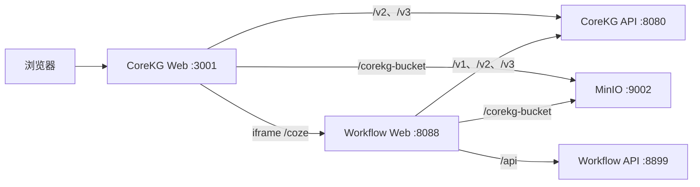

# CoreKG 前端开发指南

`frontend/` 包含两个需要配合运行的 Web 项目：

| 项目         | 目录                | 技术栈                           | 本地端口 | 用途                                          |
| ------------ | ------------------- | -------------------------------- | -------- | --------------------------------------------- |
| CoreKG Web   | `frontend/corekg`   | React、TypeScript、Vite          | `3001`   | CoreKG 主界面、知识库、问答和知识图谱         |
| Workflow Web | `frontend/workflow` | React、TypeScript、Rush、Rsbuild | `8088`   | 智能体和工作流编辑器，通过 `/coze` 嵌入主界面 |

## 请求关系



主前端和 Workflow 前端均通过开发服务器代理访问后端。不要把 Compose 内部地址（例如 `corekg:8080`）配置到浏览器端；浏览器无法解析 Compose 服务名。

## 环境要求

- Node.js 22.x（Workflow 要求 Node.js `>= 21`）
- Corepack 或 PNPM
- Docker Desktop
- 已完成后端配置和数据库初始化

后端及中间件的完整说明见：

- [项目 README](../README.md)
- [本地开发指南](../docs/local-development.md)
- [Docker Compose](../docker-compose.yml)

## 1. 启动依赖和后端

首次运行先在仓库根目录构建初始化镜像：

```bash
docker build -t corekg-init:latest \
  -f scripts/init-image/Dockerfile \
  scripts/init-image
```

如果后端也使用 Compose 运行：

```bash
docker compose build
docker compose up -d
```

如果后端在宿主机运行，只启动中间件，避免 Compose 中的 `corekg` 占用 `8080`：

```bash
docker compose up -d \
  mysql redis elasticsearch minio minio-init nats \
  metad0 storaged0 graphd nebula-activator
```

首次启动或模型结构发生变化时执行数据库迁移：

```bash
make local APP=corekg DEPLOY_MODE=on_premise
./bundles/corekg \
  -c ./apps/corekg/conf/test/config.yaml \
  --migrate-db
```

后续无需迁移时可以去掉 `--migrate-db`。启动前请确认 `apps/keinit/conf/test/core_setting.yaml` 已通过 `keinit` 写入数据库。

默认服务地址：

| 服务         | 地址                    |
| ------------ | ----------------------- |
| CoreKG API   | `http://localhost:8080` |
| Workflow API | `http://localhost:8899` |
| MinIO API    | `http://localhost:9002` |
| MinIO 控制台 | `http://localhost:9003` |

## 2. 启动 Workflow 前端

首次安装依赖：

```bash
cd frontend/workflow
node common/scripts/install-run-rush.js install
```

启动开发服务器：

```bash
cd frontend/workflow/apps/coze-studio
node ../../common/scripts/install-run-rushx.js dev \
  --host 0.0.0.0 \
  --port 8088
```

开发代理默认值定义在 `apps/coze-studio/rsbuild.config.ts`：

| 环境变量                    | 默认值                  | 用途         |
| --------------------------- | ----------------------- | ------------ |
| `COREKG_API_PROXY_TARGET`   | `http://localhost:8080` | CoreKG API   |
| `WORKFLOW_API_PROXY_TARGET` | `http://localhost:8899` | Workflow API |
| `MINIO_PROXY_TARGET`        | `http://localhost:9002` | 对象存储     |

需要覆盖时，在启动命令前设置对应环境变量。

## 3. 启动 CoreKG 主前端

首次安装依赖并创建本地配置：

```bash
cd frontend/corekg
cp .env.development.example .env.development
pnpm install
```

确认 `.env.development` 至少包含：

```dotenv
VITE_API_URL=http://localhost:8080
VITE_MINIO_URL=http://localhost:9002
VITE_WORKFLOW_URL=http://localhost:8088
```

启动主前端：

```bash
pnpm dev
```

浏览器访问 [http://localhost:3001](http://localhost:3001)。智能体页面会通过 iframe 加载 `http://localhost:8088/coze/...`。

## 构建与检查

CoreKG Web：

```bash
cd frontend/corekg
pnpm build
pnpm lint
```

Workflow Web：

```bash
cd frontend/workflow
node common/scripts/install-run-rush.js build --to @coze-studio/app
```

单独检查 Workflow 应用：

```bash
cd frontend/workflow/apps/coze-studio
node ../../common/scripts/install-run-rushx.js lint
node ../../common/scripts/install-run-rushx.js test
```
